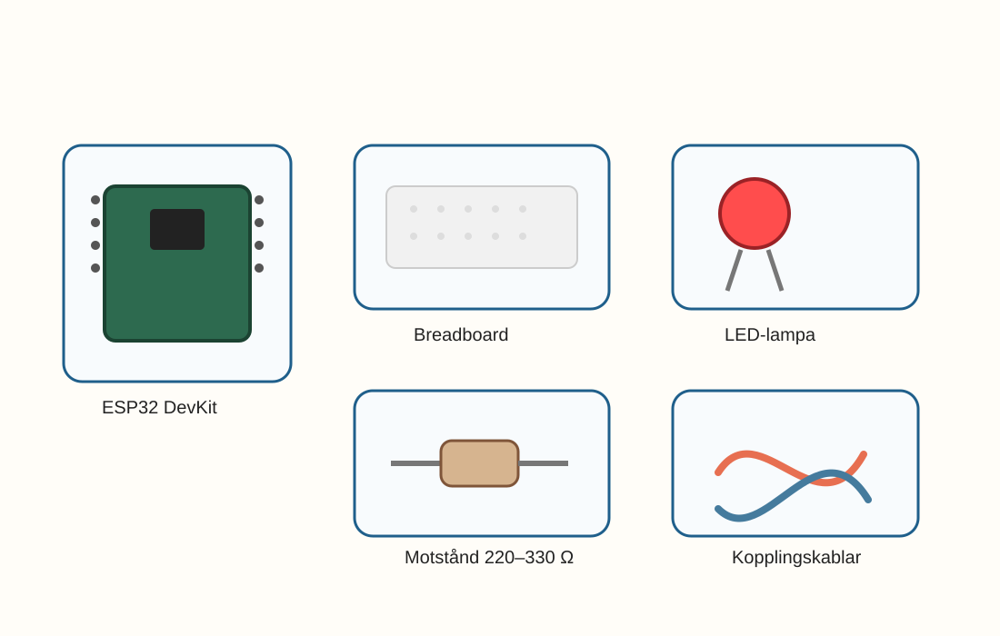
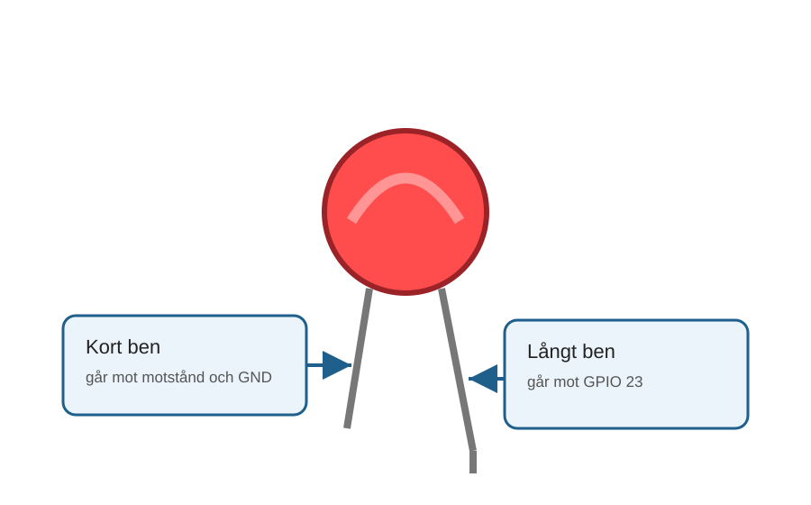
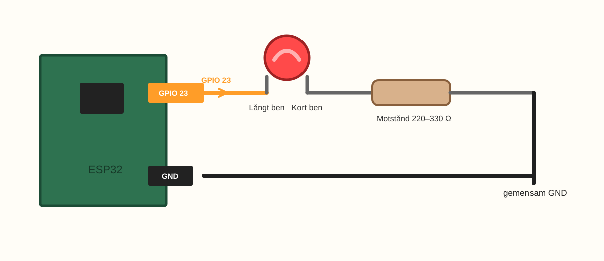

# E001 – Första blinket

## Uppdraget: väck den lilla datorn

Framför dig ligger en liten dator.

Just nu gör den nästan ingenting.

Den blinkar inte.

Den låter inte.

Den vet inte ens vad du vill att den ska göra.

Men om några minuter ska du skriva några rader kod och skicka in dem i ESP32-kortet. Då ska en liten LED-lampa börja blinka.

När den gör det betyder det något ganska häftigt:

> Din kod har nått fram.

Det här är bokens första riktiga ögonblick. Det är inte bara en lampa som blinkar. Det är första gången du får elektroniken att svara.

---

## Dagens uppfinning

Du ska bygga en enkel blinkande lampa med:

- en ESP32,
- en LED-lampa,
- ett motstånd,
- några kopplingskablar,
- en breadboard,
- och en kort kodsnutt.

När du är klar ska lampan blinka av och på, om och om igen.

Det ser enkelt ut, men det innehåller flera viktiga byggstenar som kommer tillbaka i nästan hela boken:

- en **pinne** på ESP32,
- en **utgång** som kan vara på eller av,
- en **LED** som lyser när ström går genom den,
- ett **motstånd** som skyddar LED-lampan,
- och en **loop** som gör samma sak flera gånger.

---

## Du lär dig

När du gjort experimentet har du lärt dig att:

- koppla en LED på en breadboard,
- använda ett motstånd för att skydda LED-lampan,
- välja en GPIO-pinne på ESP32,
- skriva kod som tänder och släcker en LED,
- ändra blinkhastigheten,
- felsöka som en riktig uppfinnare.

Det viktigaste du lär dig är kanske inte själva koden.

Det viktigaste är:

> Om något inte fungerar direkt betyder det att du har något att undersöka.

---

## Du behöver



_Dagens delar: ESP32, breadboard, LED, motstånd, kablar och USB._

| Del | Antal | Kommentar |
|---|---:|---|
| ESP32 DevKit | 1 | Ansluts till datorn med USB |
| Breadboard | 1 | Kopplingsplatta utan lödning |
| LED-lampa | 1 | Gärna röd, gul eller grön |
| Motstånd 220–330 Ω | 1 | Skyddar LED-lampan |
| Kopplingskablar | 2–3 | Hane–hane |
| USB-kabel | 1 | Passar ditt ESP32-kort |

> **Vuxenkoll:** Använd alltid motstånd i serie med LED-lampan. Koppla inte LED direkt mellan GPIO och GND.
---

## Innan du börjar

Titta på LED-lampan.

Den har två ben.

Ofta är det ena benet lite längre än det andra.

- Det **långa benet** ska gå mot signalen från ESP32.
- Det **korta benet** ska gå mot GND.

LED-lampor bryr sig alltså om vilket håll de sitter åt.

Om lampan inte blinkar senare kan det vara så enkelt som att den sitter baklänges. Det är inget farligt. Det är en ledtråd.

---



_LED-lampan har riktning. Långt ben går mot GPIO 23 och kort ben går vidare mot motstånd och GND._

---

# Koppla så här

Börja med att titta på hela kopplingsvägen. Sedan bygger vi den steg för steg.



_Förenklad kopplingsöversikt: GPIO 23 -> LED-lampans långa ben -> LED-lampans korta ben -> motstånd -> GND._

Nu bygger vi den lilla ljussignalen.

Ta det lugnt. Ett steg i taget.

> **Byggtips:** Koppla helst med USB-kabeln urdragen. När allt ser rätt ut ansluter du ESP32 och laddar upp koden.

## Steg 1 – Sätt ESP32 på breadboarden

Sätt ESP32-kortet så att pinnarna hamnar på varsin sida av mittspåret på breadboarden.

Om kortet är brett kan det ibland täcka många hål. Det gör inget, så länge du kommer åt några rader på båda sidor.

> **Första kontrollen:** Sitter ESP32 stadigt?

---

## Steg 2 – Sätt LED-lampan

Sätt LED-lampan på breadboarden så att benen hamnar på två olika rader.

Kom ihåg:

- långt ben = mot signal,
- kort ben = mot motståndet och vidare till GND.

> **Mikrokoll:** Benen får inte sitta i samma rad på breadboarden. Då går signalen inte genom lampan på rätt sätt.

---

## Steg 3 – Sätt motståndet

Sätt motståndet mellan LED-lampans korta ben och GND.

I den här boken använder vi samma ordning i text och bild:

> GPIO 23 → LED-lampans långa ben → LED-lampans korta ben → motstånd → GND

Motståndet är som en liten broms för strömmen. Det gör att LED-lampan inte får för mycket.

Du behöver inte kunna räkna på det nu. Det räcker att veta:

> LED + motstånd = tryggare koppling.

---

## Steg 4 – Koppla signalen

Koppla en kabel från **GPIO 23** på ESP32 till raden där LED-lampans långa ben sitter.

GPIO 23 är den pinne vi använder i det här experimentet.

Vi väljer GPIO 23 eftersom den brukar vara en trygg och tydlig allmän GPIO på vanliga ESP32 DevKit-kort.

> **Titta noga:** På vissa ESP32-kort står det bara `23`, `D23` eller `GPIO23`. Följ märkningen på just ditt kort.

---

## Steg 5 – Koppla GND

Koppla LED-lampans andra sida via motståndet till **GND** på ESP32.

GND betyder ungefär “tillbaka-vägen” för strömmen.
---

# Koden

## Stanna och gissa

Innan vi skriver koden:

Vad tror du händer om ESP32 skickar ström till GPIO 23?

- Lampan blinkar.
- Lampan lyser hela tiden.
- Ingenting händer.
- Något annat.

Det gör inget om du gissar fel. En gissning är bara början på ett experiment.

Öppna Arduino IDE eller den kodmiljö ni använder för ESP32.

Skriv in koden:

```cpp
const int ledPin = 23;

void setup() {
  pinMode(ledPin, OUTPUT);
}

void loop() {
  digitalWrite(ledPin, HIGH);
  delay(1000);

  digitalWrite(ledPin, LOW);
  delay(1000);
}
```

Ladda upp koden till ESP32.

> **Vuxenkoll:** Om uppladdningen misslyckas beror det ofta på fel port, fel kortinställning eller en USB-kabel som bara laddar men inte skickar data.

---

# Nu händer det

Titta på LED-lampan.

Om allt är rätt ska den lysa ungefär en sekund och sedan vara släckt ungefär en sekund.

På.

Av.

På.

Av.

ESP32 gör samma sak om och om igen.

Det lilla blinket betyder:

> Du har fått hårdvara att lyssna på mjukvara.

Eller enklare sagt:

> Din kod styr något i verkligheten.

Det viktiga är att koden inte stannade i datorn.

Markera gärna en liten seger här:

> Första blinket klart.

---

## Om den blinkar

Stanna en liten stund och titta på lampan.

Det kan vara frestande att rusa vidare, men just nu händer något viktigt.

Datorn följer dina instruktioner.

Inte nästan.

Inte kanske.

Den gör exakt det koden säger.

---

## Om den inte blinkar

Då har du fått ett elektronikmysterium.

Börja inte med att ändra allt på en gång. Titta efter en ledtråd i taget.

| Det du ser | Möjlig orsak | Testa |
|---|---|---|
| LED lyser inte alls | LED sitter baklänges | Vänd LED-lampan |
| LED lyser inte alls | Annan GPIO än koden använder | Kontrollera att kabeln sitter på GPIO 23 |
| LED lyser hela tiden | Koden laddades inte upp | Ladda upp igen och läs meddelanden från kodmiljön |
| LED blinkar konstigt | Kontaktproblem i breadboard | Tryck försiktigt på kablarna |
| Datorn hittar inte kortet | Fel port/USB-kabel | Testa annan port eller kabel |
| LED blir mycket stark/varm | Motstånd saknas | Dra ur USB och kontrollera kopplingen |

> **Vuxenkoll:** Om något blir varmt, dra ur USB-kabeln och undersök kopplingen innan ni fortsätter.

---

# Vad händer egentligen?

Du såg att LED-lampan inte blinkar av sig själv.

ESP32 ändrar signalen på GPIO 23. När pinnen blir **HIGH** kan LED-lampan lysa. När pinnen blir **LOW** slocknar den.

Motståndet sitter där för att bromsa strömmen så att LED-lampan får en tryggare väg.

> Kod kan ändra vad som händer i en riktig koppling.

# Testa

Nu ska du göra din första ändring.

Innan du ändrar: gissa om lampan kommer blinka snabbare eller långsammare.

Byt båda `delay(1000)` till:

```cpp
delay(500);
```

Ladda upp igen.

Vad händer?

Lampan blinkar snabbare.

Du har just ändrat beteendet hos en fysisk sak genom att ändra en siffra i koden.

Det är en liten ändring, men en stor idé.

---

# Utforska

Prova några olika värden.

| Värde | Vad tror du händer? | Vad hände? |
|---:|---|---|
| 2000 |  |  |
| 1000 |  |  |
| 500 |  |  |
| 100 |  |  |
| 50 |  |  |

När värdet blir väldigt litet kan blinket börja se mer ut som ett svagt flimmer.

Dina ögon hinner inte alltid se varje blink.

---

# Experimentera

Nu får du skapa en egen blinksignal.

Testa till exempel:

```cpp
digitalWrite(ledPin, HIGH);
delay(100);

digitalWrite(ledPin, LOW);
delay(100);

digitalWrite(ledPin, HIGH);
delay(100);

digitalWrite(ledPin, LOW);
delay(700);
```

Det blir två snabba blink och en längre paus.

Kan du göra en signal som känns som:

- ett hjärtslag,
- en robot,
- en hemlig kod,
- en fyr på havet,
- en sömnig lampa?

---

# Utmaning

Välj en av nivåerna.

## Nivå 1 – Snabbare och långsammare

Gör tre versioner:

- långsam blink,
- snabb blink,
- superlångsam blink.

## Nivå 2 – Egen rytm

Skapa ett blinkmönster med minst tre olika väntetider.

## Nivå 3 – Hemlig signal

Gör ett blinkmönster som betyder något.

Exempel:

- “hej”,
- “klart”,
- “varning”,
- “kom hit”.

Visa signalen för någon annan. Kan de gissa vad den betyder?

---

# För den vuxne

Detta första experiment är viktigt eftersom det etablerar flera saker samtidigt:

- barnet får en tidig fysisk effekt,
- GPIO introduceras praktiskt,
- `setup()` och `loop()` visas utan lång teori,
- felsökning normaliseras,
- ändring av `delay()` ger omedelbar återkoppling.

Försök att inte ta över om kopplingen inte fungerar. Ställ hellre frågor:

- Vilken väg går signalen?
- Sitter LED-lampan åt rätt håll?
- Går kopplingen tillbaka till GND?
- Är koden uppladdad till rätt kort?

Målet är inte att allt fungerar på första försöket.

Målet är att barnet lär sig att fel går att undersöka.

---

# Jag undrar...

Fundera på de här frågorna:

- Hur vet ESP32 vilken pinne som ska användas?
- Varför behöver LED-lampan ett motstånd?
- Vad händer om väntetiden är jätteliten?
- Kan en pinne också läsa något, inte bara tända något?
- Vad skulle hända om vi kopplade två lampor?

Du behöver inte svara på allt nu.

Boken kommer snart hjälpa dig att upptäcka flera av svaren.

---

# Nästa experiment

Nu har du fått en lampa att blinka.

I nästa experiment får den en egen rytm.

Då börjar blinket kännas mindre som en maskin och mer som en signal.

Och då händer något nytt:

> Lampan börjar nästan prata med blinkningar.
