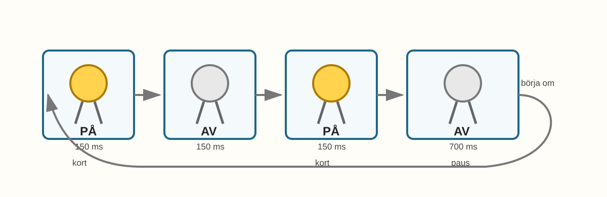
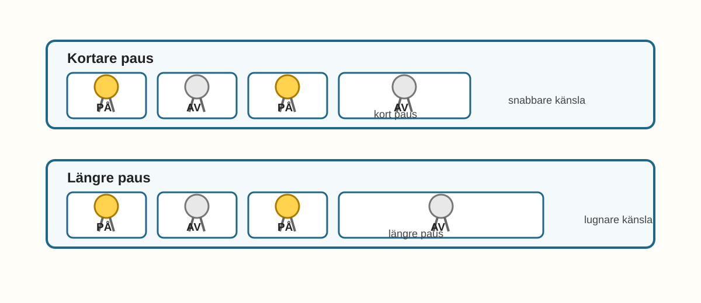
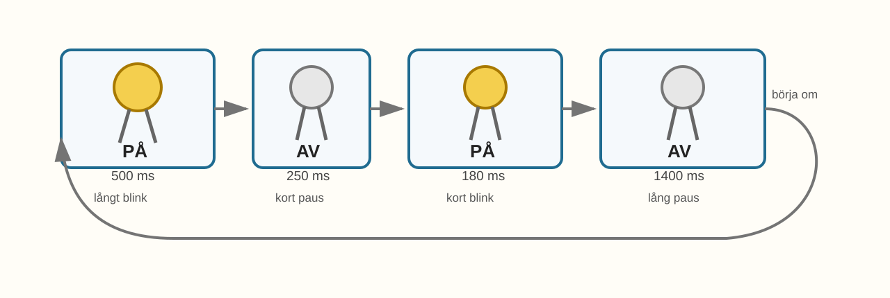

# E002 – LED med egen rytm

## Uppdraget: lär lampan en signal

I förra experimentet fick du LED-lampan att blinka.

På.

Av.

På.

Av.

Det var första tecknet på att din kod kunde styra något i verkligheten.

Nu ska lampan få något mer än ett vanligt blink.

Den ska få en **rytm**.

En rytm kan kännas som ett hjärtslag, en robot, en fyr på havet eller en hemlig signal. Du använder samma sorts koppling som i E001, men ändrar koden så att lampan inte bara blinkar jämnt.

Den börjar nästan prata med ljus.

---

## Dagens uppfinning

Du ska bygga en LED-signal med egen rytm.

När du är klar ska lampan kunna göra till exempel:

- två korta blink,
- en längre paus,
- och sedan börja om.

Det här är ett viktigt steg. Du går från:

> Datorn kan tända och släcka.

till:

> Jag kan bestämma **hur** den tänder och släcker.

---

## Du lär dig

När du gjort experimentet har du lärt dig att:

- återanvända en koppling från tidigare experiment,
- ändra kod utan att bygga om allt,
- skapa ett eget blinkmönster,
- förstå att ordningen i koden styr ordningen i verkligheten,
- använda flera `delay()`-värden för att skapa rytm,
- börja tänka på lampan som en signal,
- prova en lugn fyrtornsrytm som extra utmaning.

---

## Du behöver


_Dagens delar: samma delar som i E001 – ESP32, breadboard, LED-lampa, motstånd, kablar och USB._

| Del | Antal | Kommentar |
|---|---:|---|
| ESP32 DevKit | 1 | Samma som i E001 |
| Breadboard | 1 | Samma koppling kan återanvändas |
| LED-lampa | 1 | Gärna samma LED som i E001 |
| Motstånd 220–330 Ω | 1 | Skyddar LED-lampan |
| Kopplingskablar | 2–3 | Hane–hane |
| USB-kabel | 1 | För ström och uppladdning |

> **Vuxenkoll:** Kontrollera att LED-lampan fortfarande har ett motstånd i serie. Om ni återanvänder kopplingen från E001 behöver ni främst kontrollera att kabeln fortfarande går till GPIO 23 och att vägen tillbaka går till GND.
---

# Koppla så här

Börja med att titta på kopplingsvägen. Det är samma väg som i E001.


_Samma kopplingsväg som E001: GPIO 23 -> LED-lampans långa ben -> LED-lampans korta ben -> motstånd -> GND._

Det fina med det här experimentet är att du inte behöver börja om från noll.

Använd samma koppling som i E001:

> GPIO 23 → LED-lampans långa ben → LED-lampans korta ben → motstånd → GND

Om du redan har kvar kopplingen från E001 kan du låta den sitta.

Om du har plockat isär den, bygg den igen med hjälp av E001 eller bilden här.

---

## Snabb kopplingskontroll

Titta efter:

- LED-lampans långa ben går mot GPIO 23,
- LED-lampans korta ben går mot motståndet,
- motståndet går till GND,
- LED-benen sitter inte i samma rad på breadboarden,
- USB-kabeln är ansluten först när kopplingen ser rätt ut.

> **Mikrokoll:** Om lampan blinkade i E001 men inte gör det nu är kopplingen troligen nära rätt. Då är koden eller vald port en bra ledtråd att undersöka.
---

# Koden

Skriv in eller ersätt koden med denna:

```cpp
const int ledPin = 23;

void setup() {
  pinMode(ledPin, OUTPUT);
}

void loop() {
  // Första korta blinket
  digitalWrite(ledPin, HIGH);
  delay(150);
  digitalWrite(ledPin, LOW);
  delay(150);

  // Andra korta blinket
  digitalWrite(ledPin, HIGH);
  delay(150);
  digitalWrite(ledPin, LOW);
  delay(700);
}
```

## Stanna och gissa

Titta på koden innan du laddar upp den.

Var tror du att de två korta blinkningarna finns?

Var tror du att den långa pausen finns?

Vad tror du lampan gör efter pausen?

Ladda upp koden till ESP32.

> **Vuxenkoll:** Om uppladdningen inte fungerar, kontrollera korttyp, port och USB-kabel. Om E001 fungerade med samma dator och kort bör samma inställningar fungera här.

---

# Nu händer det



_Rytmen i E002: blink-blink-paus._

Titta på lampan.

Den borde göra ungefär så här:

> blink-blink ... paus
> blink-blink ... paus
> blink-blink ... paus

Det är inte längre ett vanligt jämnt blink.

Det är ett mönster.

Du har lärt lampan en liten signal.

Det viktiga är:

> Samma lampa. Samma koppling. Nytt beteende.

---

## Stanna och lyssna med ögonen

Försök säga rytmen högt samtidigt som lampan blinkar.

Kanske låter det som:

> kort-kort-paus

eller:

> pip-pip-vänta

Du har gjort ljus till ett språk.

Inte ett språk med ord, men ett språk med tid.

---

# Vad händer egentligen?

Du såg att samma koppling kunde få ett nytt beteende.

Det var inte LED-lampan som ändrades. Det var koden. När du ändrar ordningen på `HIGH`, `LOW` och `delay()` ändras rytmen i verkligheten.

> Samma koppling kan kännas helt annorlunda när koden ändras.

# Testa

Ändra den långa pausen från:

```cpp
delay(700);
```

till:

```cpp
delay(1200);
```

Ladda upp igen.

Vad händer?

Rytmen får mer vila mellan blinkparen.

Nu har du ändrat känslan utan att ändra kopplingen.

---

# Utforska



_Samma blink kan kännas olika beroende på pausens längd._

Prova olika tider.

| Ändring | Vad tror du händer? | Vad hände? |
|---|---|---|
| `delay(100)` för korta blink |  |  |
| `delay(300)` för korta blink |  |  |
| `delay(500)` för pausen |  |  |
| `delay(1500)` för pausen |  |  |

Titta inte bara på om lampan blinkar.

Titta på hur blinket **känns**.

---

# Experimentera

Skapa en egen signal.

Du kan använda den här mallen:

```cpp
digitalWrite(ledPin, HIGH);
delay(____);

digitalWrite(ledPin, LOW);
delay(____);
```

Kopiera raderna flera gånger och byt tiderna.

Börja med en enkel idé:

- kort-kort-lång,
- lång-kort-lång,
- kort-lång-kort,
- tre snabba blink,
- ett långsamt andetag.

---

# Utmaning

Välj en nivå.

## Nivå 1 – Fyrtorn

Kan du få lampan att kännas som ett litet fyrtorn?

Ett fyrtorn blinkar inte bara snabbt.

Det lyser en stund, väntar, lyser igen och väntar länge.

Prova den här rytmen:

> långt blink ... kort blink ........ lång paus



_Fyrtornsvarianten: samma LED-koppling som E002, men med en lugnare rytm._

Byt ut innehållet i `loop()` mot detta:

```cpp
void loop() {
  // Första långa blinket
  digitalWrite(ledPin, HIGH);
  delay(500);

  // Kort mörk paus
  digitalWrite(ledPin, LOW);
  delay(250);

  // Andra kortare blinket
  digitalWrite(ledPin, HIGH);
  delay(180);

  // Lång mörk paus innan allt börjar om
  digitalWrite(ledPin, LOW);
  delay(1400);
}
```

Titta särskilt på den långa mörka pausen.

Det är den som gör att blinket känns lugnt och tydligt.

> Pausen är också en del av signalen.

## Nivå 2 – Hjärtslag

Gör ett mönster som känns som:

> dunk-dunk ... paus

## Nivå 3 – Hemlig kod

Bestäm att olika rytmer betyder olika saker.

Exempel:

| Rytm | Betyder |
|---|---|
| kort-kort | hej |
| lång-kort | kom hit |
| kort-lång-kort | klart |

Visa signalen för någon annan. Kan de lista ut vad den betyder?

---

# Vanliga ledtrådar

Börja med kod, port och rytm innan du bygger om kopplingen.

| Det du ser | Möjlig ledtråd | Testa |
|---|---|---|
| Lampan blinkar som i E001 | Den gamla koden kan fortfarande ligga kvar | Ladda upp E002-koden igen |
| Lampan lyser inte alls | Kopplingen kan ha ändrats | Kontrollera GPIO 23, LED-riktning och GND |
| Lampan lyser hela tiden | Koden kanske inte laddades upp | Kontrollera port och uppladdningsmeddelanden |
| Rytmen känns fel | Tiderna i `delay()` är inte de du tänkte | Läs koden rad för rad |
| Det går inte att ladda upp | USB/port/kortinställning | Testa samma inställningar som fungerade i E001 |

> **Vuxenkoll:** Om E001 fungerade men E002 inte gör det är kopplingen ofta rätt. Börja då med kod, port och uppladdning innan ni bygger om allt.

---

# För den vuxne

E002 är pedagogiskt viktigt eftersom barnet får uppleva att **samma hårdvara kan få nytt beteende genom ändrad kod**.

Detta är en central idé för hela boken.

Barnet ska gärna känna:

> Jag behöver inte alltid bygga om. Ibland kan jag tänka om i koden.

Stöd barnet genom att fråga:

- Vilken rad tänder lampan?
- Vilken rad släcker lampan?
- Var finns den långa pausen?
- Vad händer om vi bara ändrar en siffra?
- Hur kan vi göra rytmen lättare att känna igen?

Försök att låta barnet välja rytmen. Då blir experimentet mer än en kopierad instruktion.

---

# Jag undrar...

Fundera på de här frågorna:

- Kan en lampa skicka ett meddelande?
- Hur många olika rytmer kan du hitta på?
- Vad händer om två lampor blinkar i olika rytm?
- Kan ljud också ha rytm?
- Kan en knapp starta eller ändra rytmen?

Du behöver inte svara på allt nu.

Några av frågorna kommer tillbaka snart.

---

# Nästa experiment

Nu har du gjort en lampa som blinkar med egen rytm.

Du har också sett att samma lampa kan kännas snabb, lugn eller nästan som ett fyrtorn.

I nästa steg får fler lampor vara med.

Då kan ljuset börja röra sig från plats till plats.

Och när flera lampor turas om händer något nytt:

> Ljuset får riktning.
