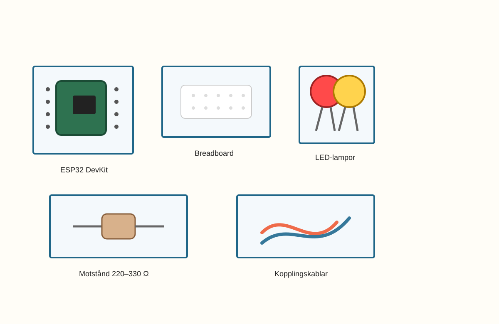
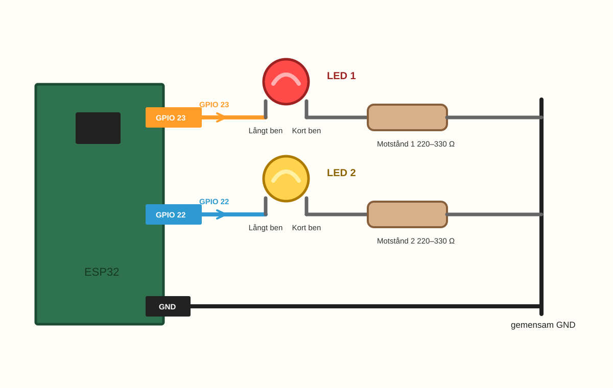
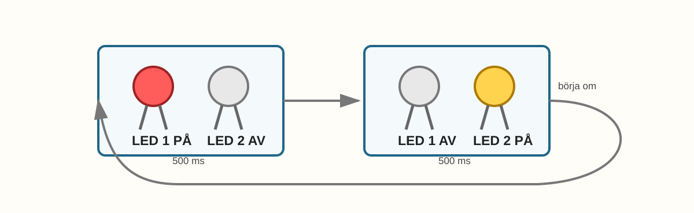

# E003 – Två LED turas om

## Uppdraget: få ljuset att röra sig

I E001 fick du en LED-lampa att blinka.

I E002 gav du samma lampa en egen rytm.

Nu ska något nytt hända.

Ljuset ska inte bara blinka på samma plats.

Det ska flytta sig.

Först lyser den ena lampan.

Sedan den andra.

Sedan den första igen.

Och plötsligt känns det som att ljuset börjar gå fram och tillbaka.

> När två lampor turas om får ljuset riktning.

Det här är första gången du låter ESP32 hålla ordning på två lampor i samma program.

---

## Dagens uppfinning

Du ska bygga en liten ljussignal med två LED-lampor.

När du är klar ska lamporna turas om:

- LED 1 lyser,
- LED 2 är släckt,
- LED 1 släcks,
- LED 2 lyser,
- och sedan börjar allt om.

Det kan se ut som en liten varningssignal eller början på ett trafikljus.

Det viktiga är den nya idén:

> En ESP32 kan styra flera utgångar, en efter en.

---

## Du lär dig

När du gjort experimentet har du lärt dig att:

- lägga till en andra LED utan att börja om från början,
- använda två GPIO-pinnar i samma program,
- ge pinnar tydliga namn i koden,
- styra två lampor i en bestämd ordning,
- se att ordningen i koden kan skapa rörelse,
- felsöka en lampa i taget.

---

## Du behöver



_Dagens delar: ESP32, breadboard, LED-lampor, motstånd, kablar och USB._

| Del | Antal | Kommentar |
|---|---:|---|
| ESP32 DevKit | 1 | Samma som tidigare |
| Breadboard | 1 | Kopplingen från E001/E002 kan byggas vidare |
| LED-lampor | 2 | Gärna två olika färger |
| Motstånd 220–330 Ω | 2 | Ett motstånd per LED |
| Kopplingskablar | 4–5 | Hane–hane |
| USB-kabel | 1 | För ström och uppladdning |

> **Vuxenkoll:** Varje LED ska ha ett eget motstånd i serie. Koppla inte två GPIO-pinnar direkt ihop med varandra.

---

## Innan du börjar

Ta fram den nya LED-lampan och titta på benen innan du sätter den.

- Det långa benet ska gå mot GPIO 22.
- Det korta benet ska gå mot motstånd och GND.

Om lampan inte blinkar senare kan riktningen vara en av de första ledtrådarna att undersöka.

---

# Koppla så här

Börja med att titta på hela kopplingsvägen. Varje LED har en egen rad.



_Förenklad kopplingsöversikt: GPIO 23 styr LED 1 och GPIO 22 styr LED 2. Varje LED har eget motstånd till GND._

Om du fortfarande har kvar kopplingen från E001 eller E002 kan du låta den första LED-lampan sitta kvar.

Nu lägger vi till en andra LED-lampa bredvid den första.

Den första lampan använder:

> GPIO 23 → LED 1 långt ben → LED 1 kort ben → motstånd → GND

Den andra lampan använder:

> GPIO 22 → LED 2 långt ben → LED 2 kort ben → motstånd → GND

Båda lamporna går tillbaka till GND, men får signal från olika GPIO-pinnar.

> **Byggtips:** Koppla helst med USB-kabeln urdragen. När båda lamporna och båda motstånden sitter rätt kan du ansluta ESP32 igen.

---

## Steg 1 – Behåll första LED-lampan

Låt kopplingen från E001/E002 sitta kvar om den fungerade:

- GPIO 23 går till LED-lampans långa ben,
- LED-lampans korta ben går till motståndet,
- motståndet går till GND.

Det här blir **LED 1**.

> **Mikrokoll:** Blinkade lampan i E001 eller E002? Då är första lampan troligen redan rätt kopplad.

---

## Steg 2 – Sätt den andra LED-lampan

Sätt den andra LED-lampan på en ledig plats på breadboarden.

Benen ska sitta i två olika rader.

Kom ihåg:

- långt ben = mot signal,
- kort ben = mot motstånd och GND.

Det här blir **LED 2**.

---

## Steg 3 – Sätt det andra motståndet

Sätt ett nytt motstånd mellan den andra LED-lampans korta ben och GND.

Det är viktigt att båda lamporna får varsin strömbroms.

> Två LED-lampor behöver två motstånd.

---

## Steg 4 – Koppla andra signalen

Koppla en kabel från **GPIO 22** på ESP32 till raden där den andra LED-lampans långa ben sitter.

Nu har ESP32 två olika pinnar som kan styra varsin lampa:

- GPIO 23 styr LED 1,
- GPIO 22 styr LED 2.

> **Titta noga:** På vissa ESP32-kort kan märkningen vara liten. Leta efter `22`, `D22` eller `GPIO22`.

---

## Steg 5 – Kontrollera vägen tillbaka

Kontrollera att båda motstånden går till GND.

Det kan vara samma GND-skena eller samma GND-punkt, bara vägen verkligen går tillbaka till ESP32:s GND.
---

# Koden

```cpp
const int ledPin1 = 23;
const int ledPin2 = 22;

void setup() {
  pinMode(ledPin1, OUTPUT);
  pinMode(ledPin2, OUTPUT);
}

void loop() {
  // Först lyser LED 1
  digitalWrite(ledPin1, HIGH);
  digitalWrite(ledPin2, LOW);
  delay(500);

  // Sedan lyser LED 2
  digitalWrite(ledPin1, LOW);
  digitalWrite(ledPin2, HIGH);
  delay(500);
}
```

## Stanna och gissa

Titta på koden innan du laddar upp den.

Vilken LED tror du lyser först?

- LED 1.
- LED 2.
- Båda samtidigt.
- Ingen av dem.

Titta sedan på andra halvan av `loop()`. Vad tror du händer där?

Ladda upp koden till ESP32.

> **Vuxenkoll:** Om uppladdningen fungerade i E001/E002 bör samma korttyp, port och USB-kabel fungera här. Om något blir varmt, dra ur USB-kabeln och kontrollera motstånd och kopplingar.

---

# Nu händer det

Titta på lamporna.

Om allt är rätt ska de turas om:

> LED 1 lyser ... LED 2 är släckt.

> LED 1 släcks ... LED 2 lyser.

Sedan börjar det om igen.

Det ser ut som att ljuset hoppar mellan två platser.



_Tidslinje för E003: först LED 1, sedan LED 2, sedan om igen._

Det stora steget är:

> Du styr två saker med samma kod.

Det är fortfarande enkel kod, men världen utanför datorn gör nu två saker i rätt ordning.

---

## Stanna och följ ljuset

Följ bytet med fingret i luften.

Vänster. Höger. Vänster. Höger.

Kanske känns det som:

> här-där-här-där

Du har gjort en liten rörelse av ljus.

---

# Vad händer egentligen?

Du såg inte bara två lampor. Du såg att ESP32 kan hålla ordning på två olika utgångar.

GPIO 23 styr LED 1. GPIO 22 styr LED 2. När koden tänder den ena och släcker den andra ser det ut som att ljuset flyttar sig.

> En ESP32 kan styra flera utgångar, en efter en.

# Testa

Ändra båda `delay(500)` till:

```cpp
delay(1000);
```

Ladda upp igen.

Vad händer?

Lamporna turas fortfarande om, men långsammare.

Du har ändrat hastigheten på ljusrörelsen.

Byt sedan tillbaka till:

```cpp
delay(300);
```

Nu går ljuset snabbare.

---

# Utforska

Prova några olika värden.

| Värde | Vad tror du händer? | Vad hände? |
|---:|---|---|
| 1000 |  |  |
| 500 |  |  |
| 300 |  |  |
| 100 |  |  |
| 50 |  |  |

När väntetiden blir väldigt liten kan det se ut som att båda lamporna nästan lyser samtidigt, eftersom ögonen inte hinner se varje byte.

> Ibland är koden snabbare än ögat.

---

# Experimentera

Nu får du skapa din egen tvålampssignal.

Du kan börja med mallen:

```cpp
digitalWrite(ledPin1, HIGH);
digitalWrite(ledPin2, LOW);
delay(____);

digitalWrite(ledPin1, LOW);
digitalWrite(ledPin2, HIGH);
delay(____);
```

Testa till exempel långsamt växelblink, snabbt växelblink, två snabba byten med lång paus eller en signal som känns som en liten robot.

Vill du göra en paus där båda lamporna är släckta kan du lägga in:

```cpp
digitalWrite(ledPin1, LOW);
digitalWrite(ledPin2, LOW);
delay(700);
```

Då får ljuset vila innan det börjar om.

---

# Utmaning

Välj en nivå.

## Nivå 1 – Långsamt och snabbt

Gör två versioner:

- en långsam växling,
- en snabb växling.

Vilken känns mest som en signal?

---

## Nivå 2 – Vaktljus

Gör en signal som känns som att två lampor vaktar en dörr:

> vänster ... höger ... vänster ... höger

Testa om det känns mer spännande med kort eller lång väntetid.

---

## Nivå 3 – Egen ordning

Gör ett mönster där lamporna inte bara turas om jämnt.

Exempel:

| Steg | LED 1 | LED 2 | Tid |
|---|---|---|---:|
| 1 | på | av | 100 ms |
| 2 | av | på | 100 ms |
| 3 | på | av | 100 ms |
| 4 | av | av | 700 ms |

Kan någon annan gissa vad signalen betyder?

---

# Vanliga ledtrådar

Kontrollera en lampa i taget. Följ varje väg från GPIO till GND.

| Det du ser | Möjlig ledtråd | Testa |
|---|---|---|
| Bara LED 1 lyser | LED 2 kan sitta baklänges eller vara kopplad till fel GPIO | Kontrollera LED 2:s långa ben och kabeln till GPIO 22 |
| Bara LED 2 lyser | LED 1 kan ha lossnat eller fel koppling | Kontrollera kopplingen från GPIO 23 |
| Båda lyser samtidigt | Koden kan ha laddats fel eller båda pinnar är satta HIGH | Läs `digitalWrite()`-raderna rad för rad |
| Ingen lampa lyser | GND, motstånd eller uppladdning kan saknas | Kontrollera vägen tillbaka till GND och ladda upp igen |
| En LED blir mycket stark/varm | Motstånd saknas eller sitter fel | Dra ur USB och kontrollera att varje LED har eget motstånd |
| Lamporna byter för snabbt | `delay()` är väldigt litet | Testa `delay(500)` eller `delay(1000)` |

> **Vuxenkoll:** Felsök helst en LED i taget. Om en lampa fungerar, ändra inte den i onödan. Leta efter ledtråden i den andra lampans väg: GPIO → långt ben → kort ben → motstånd → GND.

---

# För den vuxne

E003 är pedagogiskt viktigt eftersom barnet går från en styrd utgång till två styrda utgångar. Det öppnar för trafikljus, polisljus, spelstatus och enkla ljussekvenser senare i boken.

Hjälp gärna barnet att inte bygga om allt om något inte fungerar. Fråga hellre:

- Vilken GPIO styr LED 1?
- Vilken GPIO styr LED 2?
- Har båda LED-lamporna varsitt motstånd?
- Vilken rad i koden tänder respektive lampa?

Målet är att barnet börjar se kopplingen mellan kodens ordning och ljusets ordning.

---

# Jag undrar...

Fundera på de här frågorna:

- Kan tre lampor turas om på samma sätt?
- Kan lamporna visa en riktning?
- Vad händer om båda lamporna är tända samtidigt ibland?
- Kan man göra ett trafikljus med samma idé?
- Kan en knapp välja vilken lampa som ska lysa?

Du behöver inte svara på allt nu.

Flera av frågorna kommer snart tillbaka.

---

# Nästa experiment

Nu har du fått två lampor att turas om.

I nästa experiment får samma två lampor en helt annan känsla.

De ska inte bara växla lugnt.

De ska blinka snabbt, med mörka pauser emellan.

Och då händer något nytt:

> Samma två lampor kan kännas som en signal.
