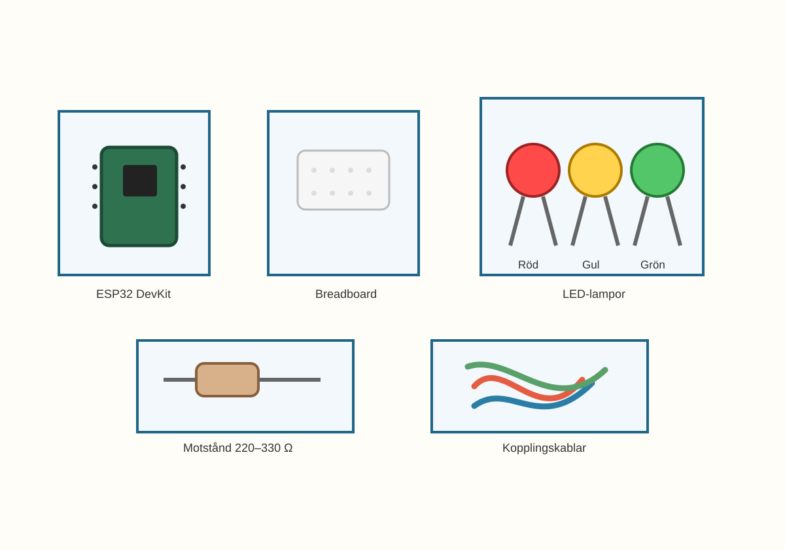
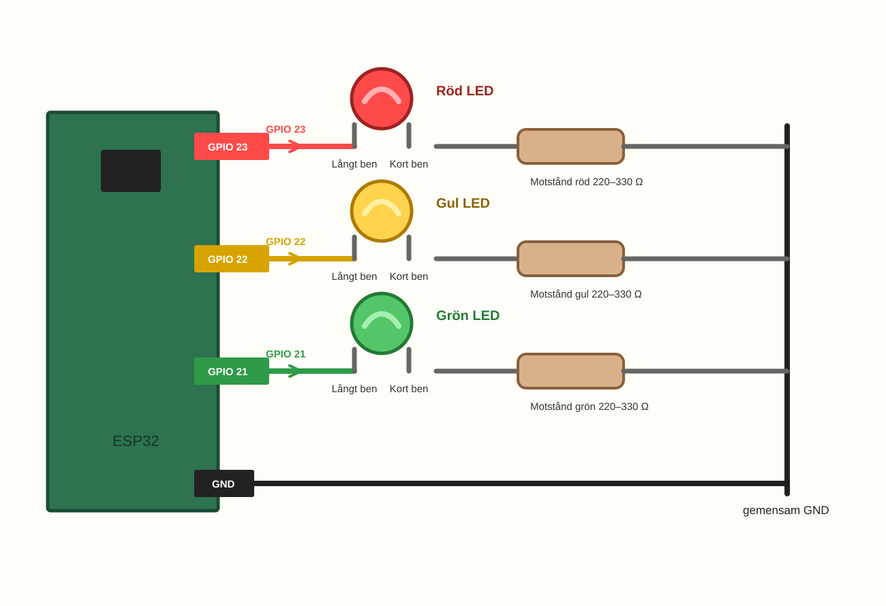
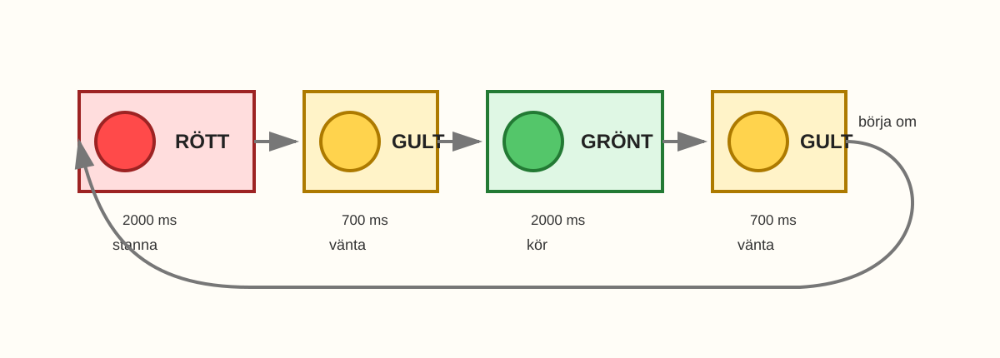

# E004 – Mini-trafikljus

## Uppdraget: ge ljuset regler

I E001 fick en LED-lampa blinka.

I E002 fick samma lampa rytm – och kunde nästan kännas som ett fyrtorn.

I E003 fick två lampor turas om.

I E005 fick två lampor bli en snabb signal.

Nu avslutar vi kapitlet med att låta tre lampor samarbeta.

Ljuset ska få en betydelse som många känner igen:

> rött = stanna, gult = vänta, grönt = kör.

I det här experimentet bygger du ett mini-trafikljus. Det är inte för riktiga bilar, men det använder samma idé: flera lampor tänds i en bestämd ordning.

Nu får flera LED-lampor tillsammans likna ett litet system från verkligheten.

---

## Dagens uppfinning

Du ska bygga ett litet trafikljus med tre LED-lampor: röd, gul och grön.

När du är klar ska lamporna tändas i en enkel ordning:

1. rött,
2. gult,
3. grönt,
4. gult igen,
5. omstart.

Det här är en förenklad modell. I riktiga trafikljus kan ordningen vara annorlunda, till exempel med rött och gult tillsammans. Här låter vi bara en färg lysa i taget så att principen blir lätt att följa.

> Flera utgångar kan tillsammans visa ett meddelande.

---

## Du lär dig

När du gjort experimentet har du lärt dig att:

- bygga vidare från två LED till tre LED,
- använda tre GPIO-pinnar i samma program,
- ge varje LED ett tydligt namn i koden,
- tända en lampa i taget,
- skapa en sekvens med flera steg,
- felsöka en färg i taget.

---

## Du behöver



_Dagens delar: ESP32, breadboard, LED-lampor, motstånd, kablar och USB._

| Del | Antal | Kommentar |
|---|---:|---|
| ESP32 DevKit | 1 | Samma som tidigare |
| Breadboard | 1 | Kopplingsplatta utan lödning |
| LED-lampor | 3 | Helst röd, gul och grön |
| Motstånd 220–330 Ω | 3 | Ett motstånd per LED |
| Kopplingskablar | 6–7 | Hane–hane |
| USB-kabel | 1 | För ström och uppladdning |

> **Vuxenkoll:** Varje LED ska ha ett eget motstånd i serie. Om någon LED blir starkt varm eller luktar konstigt: dra ur USB-kabeln och kontrollera kopplingen.

---

## Innan du börjar

Titta på de tre LED-lamporna innan du sätter dem.

Varje LED har två ben:

- långt ben går mot sin GPIO-pinne,
- kort ben går mot motstånd och GND.

I det här experimentet använder vi:

- röd LED på GPIO 23,
- gul LED på GPIO 22,
- grön LED på GPIO 21.

Om en färg inte lyser senare är riktningen en av de första sakerna att undersöka.

---

# Koppla så här

Börja med att titta på hela kopplingsvägen. Trafikljuset är tre separata ljusvägar.



_Förenklad kopplingsöversikt: GPIO 23 styr röd LED, GPIO 22 styr gul LED och GPIO 21 styr grön LED. Varje LED har eget motstånd till GND._

Om du har kvar kopplingen från E003 kan du bygga vidare på den.

Nu behöver vi tre separata ljusvägar:

> GPIO 23 → röd LED långt ben → röd LED kort ben → motstånd → GND

> GPIO 22 → gul LED långt ben → gul LED kort ben → motstånd → GND

> GPIO 21 → grön LED långt ben → grön LED kort ben → motstånd → GND

Alla tre LED-lampor går tillbaka till GND, men varje LED får signal från en egen GPIO-pinne.

> **Byggtips:** Koppla helst med USB-kabeln urdragen. När alla tre lampor och tre motstånd sitter rätt kan du ansluta ESP32 igen.

---

## Steg 1 – Sätt den röda LED-lampan

Sätt den röda LED-lampan på breadboarden.

- Långt ben går mot GPIO 23.
- Kort ben går mot ett motstånd.
- Motståndet går vidare till GND.

Det här blir trafikljusets stoppljus.

---

## Steg 2 – Sätt den gula LED-lampan

Sätt den gula LED-lampan på en egen plats på breadboarden. Benen ska sitta i två olika rader.

- Långt ben går mot GPIO 22.
- Kort ben går mot ett eget motstånd.
- Motståndet går vidare till GND.

Gult blir lampan som säger vänta.

---

## Steg 3 – Sätt den gröna LED-lampan

Sätt den gröna LED-lampan bredvid de andra.

- Långt ben går mot GPIO 21.
- Kort ben går mot ett eget motstånd.
- Motståndet går vidare till GND.

Grönt blir lampan som säger kör.

> **Titta noga:** På vissa ESP32-kort är märkningen liten. Leta efter `23`, `22` och `21` eller `GPIO23`, `GPIO22` och `GPIO21`.

---

## Steg 4 – Kontrollera alla tre vägar

Följ varje färg med fingret:

- röd: GPIO 23 → långt ben → kort ben → motstånd → GND,
- gul: GPIO 22 → långt ben → kort ben → motstånd → GND,
- grön: GPIO 21 → långt ben → kort ben → motstånd → GND.

Det är lättare att hitta fel om du följer en färg i taget.

> Ett trafikljus är tre enkla LED-kopplingar som samarbetar.
---

# Koden

```cpp
const int redPin = 23;
const int yellowPin = 22;
const int greenPin = 21;

void setup() {
  pinMode(redPin, OUTPUT);
  pinMode(yellowPin, OUTPUT);
  pinMode(greenPin, OUTPUT);
}

void loop() {
  // Rött: stanna
  digitalWrite(redPin, HIGH);
  digitalWrite(yellowPin, LOW);
  digitalWrite(greenPin, LOW);
  delay(2000);

  // Gult: vänta
  digitalWrite(redPin, LOW);
  digitalWrite(yellowPin, HIGH);
  digitalWrite(greenPin, LOW);
  delay(700);

  // Grönt: kör
  digitalWrite(redPin, LOW);
  digitalWrite(yellowPin, LOW);
  digitalWrite(greenPin, HIGH);
  delay(2000);

  // Gult igen: vänta
  digitalWrite(redPin, LOW);
  digitalWrite(yellowPin, HIGH);
  digitalWrite(greenPin, LOW);
  delay(700);
}
```

## Stanna och gissa

Titta på koden innan du laddar upp den.

Vilken ordning tror du att färgerna kommer i?

- rött → gult → grönt → gult
- grönt → gult → rött
- alla färger samtidigt
- något annat

Titta särskilt på var koden skriver `HIGH` för röd, gul och grön.

Ladda upp koden till ESP32.

> **Vuxenkoll:** Om uppladdningen fungerade i tidigare experiment bör samma korttyp, port och USB-kabel fungera här. Om något blir varmt, dra ur USB-kabeln innan ni felsöker.

---

# Nu händer det

Titta på lamporna.

Om allt är rätt ska de visa en liten trafikljussekvens:

> rött ... gult ... grönt ... gult ...

Sedan börjar den om.



_Tidslinje för E004: rött, gult, grönt och gult igen._

Nu gör lamporna mer än att blinka.

De berättar något enkelt:

- rött känns som stopp,
- gult känns som vänta,
- grönt känns som kör.

Det stora steget är:

> Kod kan göra lampor till ett enkelt meddelande.

---

## Stanna och spela trafikljus

Låt någon annan titta på lamporna.

När rött lyser säger de “stopp”. När gult lyser säger de “vänta”. När grönt lyser säger de “kör”.

Känns sekvensen långsam, snabb eller lagom?

Kom ihåg: det här är en modell. Den behöver vara tydlig, inte exakt som ett riktigt trafikljus.

---

# Vad händer egentligen?

Du såg att tre lampor tillsammans kan bli ett litet system.

Varje färg har sin egen GPIO-pinne. Koden bestämmer vilken färg som lyser och vilken som är släckt. När ordningen upprepas börjar lamporna kännas som ett enkelt meddelande.

> Kod kan göra flera lampor till ett enkelt system.

# Testa

Ändra tiden för rött från:

```cpp
delay(2000);
```

till:

```cpp
delay(4000);
```

Ladda upp igen.

Rött lyser längre och trafikljuset känns långsammare.

Byt sedan den gröna tiden till:

```cpp
delay(1000);
```

Nu blir grönt kortare.

> När du ändrar tiden ändrar du hur systemet känns.

---

# Utforska

Prova några olika tider.

| Ändring | Vad tror du händer? | Vad hände? |
|---|---|---|
| rött 1000 ms |  |  |
| rött 4000 ms |  |  |
| gult 300 ms |  |  |
| gult 1500 ms |  |  |
| grönt 1000 ms |  |  |
| grönt 3000 ms |  |  |

Titta inte bara på vilken lampa som lyser. Titta på hur hela trafikljuset känns: stressigt, lugnt eller tydligt?

---

# Experimentera

Nu får du göra din egen trafikljusvariant.

Du kan ändra hur länge varje färg lyser, om gult ska vara med en eller två gånger, eller lägga in en liten paus där alla lampor är släckta.

Vill du lägga in en mörk paus kan du använda:

```cpp
digitalWrite(redPin, LOW);
digitalWrite(yellowPin, LOW);
digitalWrite(greenPin, LOW);
delay(500);
```

Då får trafikljuset en liten vila.

---

# Utmaning

Välj en nivå.

## Nivå 1 – Snabbt trafikljus

Gör en kort version där hela sekvensen går snabbare. Fungerar den fortfarande att förstå?

---

## Nivå 2 – Lugnare trafikljus

Gör en version där rött och grönt lyser länge, men gult bara lyser kort. Känns den tydligare?

---

## Nivå 3 – Egen regel

Hitta på en egen regel för trafikljuset.

Exempel:

| Regel | Betydelse |
|---|---|
| rött länge | alla väntar |
| gult blinkar två gånger | vänta |
| grönt kort | skynda, men säkert |

Visa din regel för någon annan. Kan de förstå vad trafikljuset försöker säga?

---

# Vanliga ledtrådar

Felsök en färg i taget. Följ just den färgens väg från GPIO till GND.

| Det du ser | Möjlig ledtråd | Testa |
|---|---|---|
| En färg lyser aldrig | Den LED-lampan kan sitta baklänges eller ha fel GPIO | Följ just den färgens väg från GPIO till GND |
| Två färger lyser samtidigt | Koden släcker kanske inte den andra färgen | Läs `digitalWrite()`-raderna i det steget |
| Fel färg lyser | Kablarna kan sitta på fel GPIO | Kontrollera röd 23, gul 22, grön 21 |
| Ingen färg lyser | GND, motstånd eller uppladdning kan saknas | Kontrollera vägen tillbaka till GND och ladda upp igen |
| En LED blir mycket stark/varm | Motstånd saknas eller sitter fel | Dra ur USB och kontrollera att varje LED har eget motstånd |
| Sekvensen känns fel | `delay()`-värdena är inte de du tänkte | Läs tiderna rad för rad |

> **Vuxenkoll:** Felsök helst en färg i taget. Om rött fungerar, låt rött vara. Gå vidare till gul eller grön och följ bara den kopplingsvägen.

---

# För den vuxne

E004 är pedagogiskt viktigt eftersom barnet går från två lampor som turas om till ett litet system med igenkännbar betydelse.

Det tekniska steget är litet: en tredje LED och en tredje GPIO-pinne. Det begreppsliga steget är att kod, tid och flera utgångar kan skapa ett mönster som andra människor förstår.

Stöd gärna barnet genom att fråga:

- Vilken färg är tänd nu?
- Vilken rad i koden tänder den färgen?
- Vilka rader släcker de andra färgerna?
- Vilken tid behöver ändras om trafikljuset känns för snabbt?

Målet är inte att trafikljuset ska vara exakt som i verkligheten. Målet är att barnet börjar förstå hur flera enkla delar kan bli ett litet system.

---

# Jag undrar...

Fundera på de här frågorna:

- Varför använder trafikljus olika färger?
- Vad händer om två färger lyser samtidigt?
- Kan ett trafikljus ha olika tider på dagen och natten?
- Hur skulle en knapp kunna påverka trafikljuset?
- Kan man bygga ett trafikljus för fotgängare också?

Du behöver inte svara på allt nu. Flera av frågorna kommer tillbaka senare.

---

# Kapitelavslutning

Nu har du byggt ett litet trafikljus.

Under kapitlet har du använt en LED, två LED och tre LED.

Du har fått ljuset att blinka, vänta, turas om och följa regler.

Det är en bra avslutning på första kapitlet:

> Flera enkla delar kan bli ett litet system.

I nästa kapitel börjar vi undersöka hur ljus kan styras på fler sätt.
