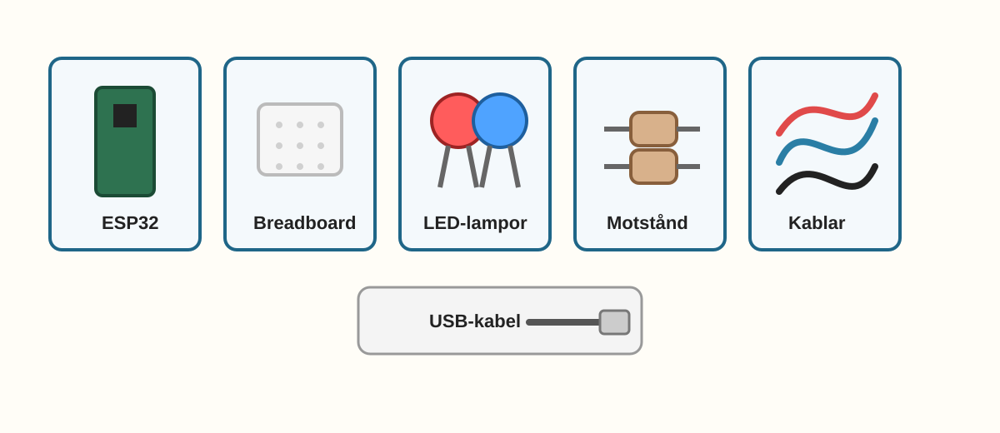
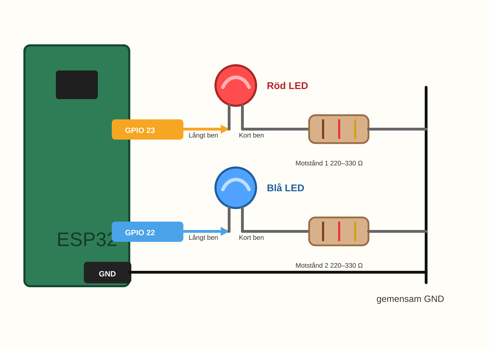
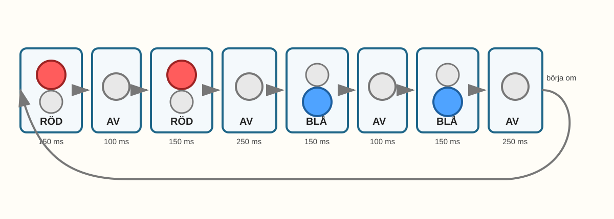

# E005 – Polisljus

## Uppdraget: bygg en snabb varningssignal

I E003 fick två LED-lampor turas om.

Nu ska samma två lampor få en helt annan känsla.

De ska blinka snabbt.

Först två röda blink.

Sedan två blå blink.

Sedan börjar allt om.

Plötsligt känns ljuset inte lugnt längre. Det känns som en liten varningssignal.

> Samma två lampor kan kännas helt olika när rytmen ändras.

Det här är ett leksaksexperiment. Det ska hjälpa dig förstå signaler, rytm och kod. Använd det inte som en riktig utryckningssignal.

---

## Dagens uppfinning

Du ska bygga ett litet polisljus med två LED-lampor.

När du är klar ska lamporna göra en snabb sekvens:

- den röda LED-lampan blinkar två gånger,
- den blå LED-lampan blinkar två gånger,
- sedan börjar allt om.

Det viktiga är inte att det blir exakt som en riktig polisbil.

Det viktiga är att du ser hur kod kan skapa en känsla:

> långsamt känns lugnt, snabbt känns bråttom.

---

## Du lär dig

När du gjort experimentet har du lärt dig att:

- återanvända två LED-kopplingar från E003,
- skapa en snabbare blinksekvens,
- lägga in korta pauser där båda lamporna är släckta,
- läsa en längre `loop()` i små delar,
- ändra rytmen utan att ändra kopplingen,
- skapa en signal som känns mer dramatisk.

---

## Du behöver



_Dagens delar: ESP32, breadboard, två LED-lampor, två motstånd, kablar och USB._

| Del | Antal | Kommentar |
|---|---:|---|
| ESP32 DevKit | 1 | Samma som tidigare |
| Breadboard | 1 | Kopplingsplatta utan lödning |
| LED-lampor | 2 | Helst röd och blå, annars två olika färger |
| Motstånd 220–330 Ω | 2 | Ett motstånd per LED |
| Kopplingskablar | 4–5 | Hane–hane |
| USB-kabel | 1 | För ström och uppladdning |

> **Vuxenkoll:** Detta är ett modell- och leksaksexperiment. Använd inte blinkande röd/blå signal på cykel, fordon eller ute på ett sätt som kan förväxlas med riktig utryckningssignal.

---

## Innan du börjar

Om du har kvar kopplingen från E003 kan du använda den igen.

I det här experimentet använder vi:

- röd LED på GPIO 23,
- blå LED på GPIO 22.

Om du inte har en blå LED kan du använda en annan färg. Koden fungerar ändå. Det viktiga är att du har två olika lampor.

---

# Koppla så här

Börja med att titta på kopplingsvägen.



_Förenklad kopplingsöversikt: GPIO 23 styr röd LED och GPIO 22 styr blå LED. Varje LED har eget motstånd till GND._

Du bygger två separata ljusvägar:

> GPIO 23 → röd LED långt ben → röd LED kort ben → motstånd → GND

> GPIO 22 → blå LED långt ben → blå LED kort ben → motstånd → GND

Båda LED-lampor går tillbaka till GND, men de får signal från varsin GPIO-pinne.

> **Byggtips:** Koppla helst med USB-kabeln urdragen. När båda lamporna och båda motstånden sitter rätt kan du ansluta ESP32 igen.

---

## Steg 1 – Sätt den röda LED-lampan

Sätt den röda LED-lampan på breadboarden.

- Långt ben går mot GPIO 23.
- Kort ben går mot ett motstånd.
- Motståndet går vidare till GND.

---

## Steg 2 – Sätt den blå LED-lampan

Sätt den blå LED-lampan på en egen plats på breadboarden.

- Långt ben går mot GPIO 22.
- Kort ben går mot ett eget motstånd.
- Motståndet går vidare till GND.

Om du använder en annan färg än blå kan du ändå låta variabeln heta `bluePin`. Namnet hjälper dig bara hålla ordning i koden.

---

## Steg 3 – Kontrollera båda vägarna

Följ varje färg med fingret:

- röd: GPIO 23 → långt ben → kort ben → motstånd → GND,
- blå: GPIO 22 → långt ben → kort ben → motstånd → GND.

> **Mikrokoll:** Om E003 fungerade är det här nästan samma koppling. Det nya sitter mest i rytmen.

---

# Koden

Skriv in eller ersätt koden med denna:

```cpp
const int redPin = 23;
const int bluePin = 22;

void setup() {
  pinMode(redPin, OUTPUT);
  pinMode(bluePin, OUTPUT);
}

void loop() {
  // Rött blink 1
  digitalWrite(redPin, HIGH);
  digitalWrite(bluePin, LOW);
  delay(150);

  // Kort mörk paus
  digitalWrite(redPin, LOW);
  digitalWrite(bluePin, LOW);
  delay(100);

  // Rött blink 2
  digitalWrite(redPin, HIGH);
  digitalWrite(bluePin, LOW);
  delay(150);

  // Lite längre mörk paus
  digitalWrite(redPin, LOW);
  digitalWrite(bluePin, LOW);
  delay(250);

  // Blått blink 1
  digitalWrite(redPin, LOW);
  digitalWrite(bluePin, HIGH);
  delay(150);

  // Kort mörk paus
  digitalWrite(redPin, LOW);
  digitalWrite(bluePin, LOW);
  delay(100);

  // Blått blink 2
  digitalWrite(redPin, LOW);
  digitalWrite(bluePin, HIGH);
  delay(150);

  // Lite längre mörk paus innan allt börjar om
  digitalWrite(redPin, LOW);
  digitalWrite(bluePin, LOW);
  delay(250);
}
```

## Stanna och gissa

Titta på koden innan du laddar upp den.

Vilken färg tror du blinkar först?

- röd
- blå
- båda samtidigt
- ingen av dem

Titta sedan efter de rader där båda lamporna är `LOW`.

Vad tror du händer då?

Ladda upp koden till ESP32.

> **Vuxenkoll:** Om uppladdningen fungerade i tidigare experiment bör samma korttyp, port och USB-kabel fungera här. Om något blir varmt, dra ur USB-kabeln innan ni felsöker.

---

# Nu händer det

Titta på lamporna.

Om allt är rätt ska de blinka ungefär så här:

> rött – rött ... blått – blått ... rött – rött ... blått – blått ...



_Sekvensen i E005: röd blinkar två gånger, blå blinkar två gånger och allt börjar om._

Det ser annorlunda ut än E003, trots att kopplingen nästan är samma.

Det stora steget är:

> Rytmen kan ändra hur en signal känns.

---

## Stanna och titta på pauserna

Försök se de små mörka pauserna mellan blinkningarna.

De är korta, men de gör stor skillnad.

Utan pauserna skulle ljuset mest se ut som att det lyser.

Med pauserna känns det som blink.

---

# Vad händer egentligen?

Du såg att två LED-lampor kan skapa en snabb signal.

Koden tänder bara en färg i taget. Mellan blinkningarna släcker den båda lamporna en kort stund. De små mörka pauserna gör att ögat hinner uppfatta varje blink.

> En signal består både av ljus och av paus.

När du ändrar `delay()` ändrar du inte bara hastigheten. Du ändrar känslan.

---

# Testa

Ändra de korta blinkningarna från:

```cpp
delay(150);
```

till:

```cpp
delay(300);
```

Ladda upp igen.

Vad händer?

Blinken blir längre och signalen känns mindre stressig.

Ändra sedan tillbaka till `150` och byt de mörka pauserna från:

```cpp
delay(100);
```

till:

```cpp
delay(30);
```

Nu blir pauserna svårare att se.

---

# Utforska

Prova några olika tider.

| Ändring | Vad tror du händer? | Vad hände? |
|---|---|---|
| blink 80 ms |  |  |
| blink 150 ms |  |  |
| blink 300 ms |  |  |
| mörk paus 30 ms |  |  |
| mörk paus 150 ms |  |  |
| lång paus 500 ms |  |  |

Titta inte bara på om lamporna blinkar.

Titta på hur signalen känns:

- stressig,
- tydlig,
- långsam,
- nästan för snabb.

---

# Experimentera

Nu får du skapa en egen varningssignal.

Du kan ändra:

- hur många gånger rött blinkar,
- hur många gånger blått blinkar,
- hur lång pausen är mellan färgerna,
- om båda lamporna ska vara släckta längre ibland.

Börja med en enkel idé:

> röd – blå – röd – blå

eller:

> röd – röd – röd ... blå

Kom ihåg att ändra en sak i taget. Då är det lättare att förstå vad som hände.

---

# Utmaning

Välj en nivå.

## Nivå 1 – Långsammare signal

Gör signalen långsammare så att varje blink blir lätt att räkna.

---

## Nivå 2 – Egen rytm

Gör en signal som har tre röda blink och ett blått blink.

Kan någon annan se rytmen?

---

## Nivå 3 – Hemlig kod

Bestäm att rött betyder en sak och blått betyder en annan.

Exempel:

| Signal | Betydelse |
|---|---|
| röd-röd | hjälp |
| blå-blå | klart |
| röd-blå-röd | börja om |

Visa signalen för någon annan. Kan de gissa vad den betyder?

---

# Vanliga ledtrådar

Felsök en färg i taget.

| Det du ser | Möjlig ledtråd | Testa |
|---|---|---|
| Bara röd blinkar | Blå LED kan sitta fel eller vara kopplad till fel GPIO | Följ blå väg från GPIO 22 till GND |
| Bara blå blinkar | Röd LED kan sitta fel eller vara kopplad till fel GPIO | Följ röd väg från GPIO 23 till GND |
| Båda lyser samtidigt | Koden kanske inte släcker den andra färgen | Läs `digitalWrite()`-raderna i varje steg |
| Ingen LED blinkar | GND, motstånd eller uppladdning kan saknas | Kontrollera vägen tillbaka till GND och ladda upp igen |
| Blinket syns nästan inte | Pauserna är för korta | Testa längre mörk paus |
| En LED blir mycket stark/varm | Motstånd saknas eller sitter fel | Dra ur USB och kontrollera att varje LED har eget motstånd |

> **Vuxenkoll:** Om barnet vill göra signalen mycket snabb, påminn om att mycket korta pauser kan bli svåra att se. Det är en bra observation, inte ett fel.

---

# För den vuxne

E005 bygger tekniskt på E003: två GPIO-pinnar styr varsin LED med var sitt motstånd.

Det nya är rytmen. Barnet får se att samma koppling kan kännas lugn, tydlig eller dramatisk beroende på tiderna i koden.

Det är också ett bra tillfälle att prata om modell och verklighet. Experimentet är ett sätt att förstå signaler, inte en riktig utryckningsanordning.

Frågor som hjälper:

- Vilken rad tänder rött?
- Vilken rad tänder blått?
- Var släcks båda lamporna?
- Vad händer om pausen blir för kort?
- Hur kan man göra signalen tydligare utan att koppla om?

---

# Jag undrar...

Fundera på de här frågorna:

- Varför syns blink bättre om lampan släcks mellan blinkningarna?
- Hur snabb kan en blinkning vara innan ögat inte hinner med?
- Kan två lampor betyda mer än en lampa?
- Varför använder riktiga varningssignaler ofta starka färger?
- Kan man göra en lugn signal med samma två lampor?

Du behöver inte svara på allt nu. Frågorna kommer tillbaka när vi börjar bygga fler signaler och egna uppfinningar.

---

# Nästa experiment

Nu har du gjort en snabb signal med två lampor.

I nästa experiment får tre lampor samarbeta.

De ska inte bara blinka snabbt.

De ska följa en lugn ordning som många känner igen:

rött, gult, grönt.

Då händer något nytt:

> Ljuset börjar ge regler.
