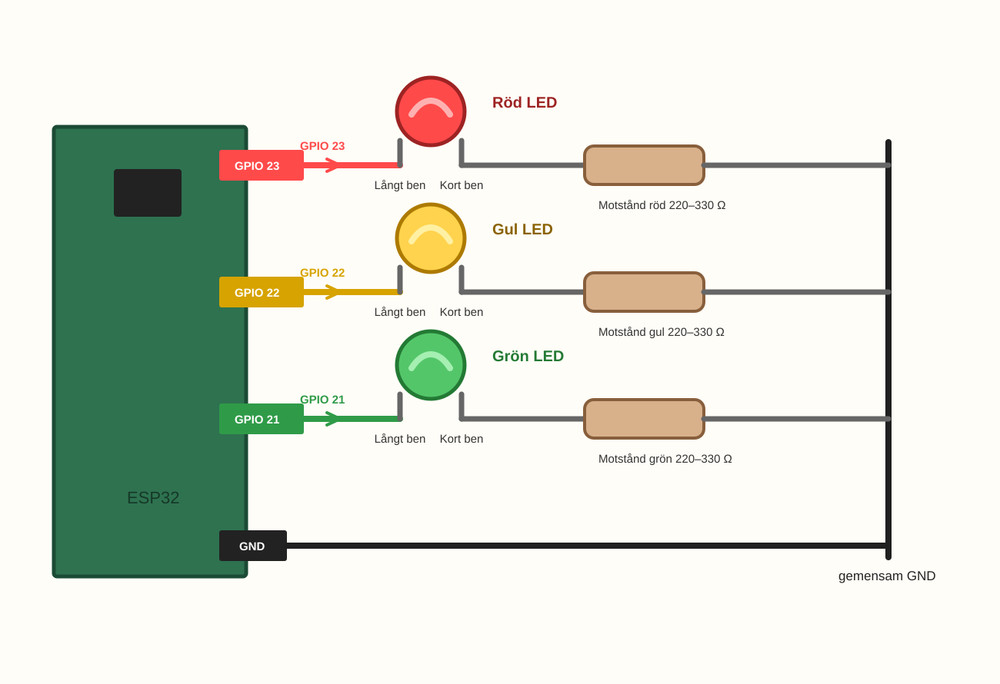
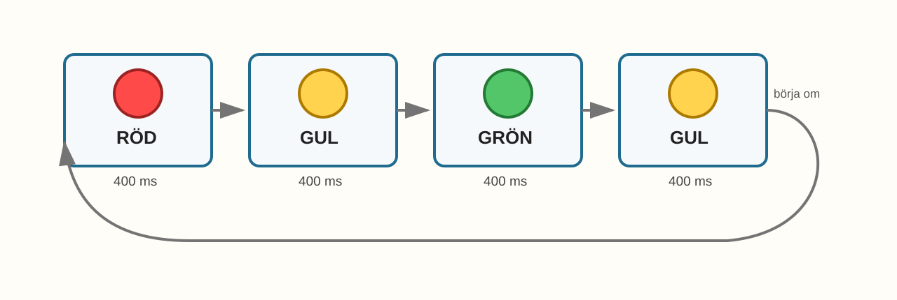
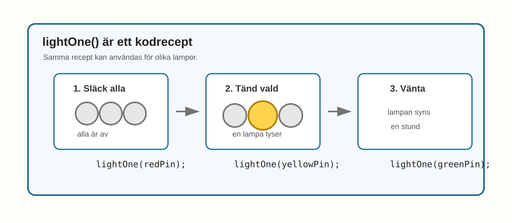

# E007 – LED-stafett

## Uppdraget: låt ljuset skicka vidare

I slutet av Kapitel 1 byggde du ett mini-trafikljus.

Där fick tre LED-lampor lysa i en bestämd ordning.

Nu använder vi nästan samma koppling igen.

Men den här gången ska lamporna inte vara ett trafikljus.

De ska bli en liten stafett.

En lampa tänds.

Sedan skickar den vidare till nästa.

Sedan till nästa.

Ljuset rör sig som om någon lämnar över en osynlig stafettpinne.

Det nya är inte att koppla fler saker.

Det nya är att vi börjar göra koden smartare.

> När samma kodidé behövs flera gånger kan vi göra ett litet kodrecept.

---

## Dagens uppfinning

Du ska bygga en LED-stafett med tre LED-lampor.

När du är klar ska ljuset gå i ordning:

1. röd,
2. gul,
3. grön,
4. gul igen,
5. börja om.

Det liknar trafikljuset från E004, men nu ska vi skriva koden på ett nytt sätt.

I stället för att skriva nästan samma rader om och om igen skapar vi ett litet kodrecept.

Kodreceptet får namnet `lightOne()`.

Det ser kanske lite mer vuxet ut i koden, men du behöver inte förstå allt på en gång.

Börja bara med idén:

> samma recept kan användas för olika lampor.

---

## Du lär dig

När du gjort experimentet har du lärt dig att:

- återanvända tre LED-lampor från E004,
- låta ljuset flytta sig från lampa till lampa,
- förstå att en funktion kan vara som ett litet kodrecept,
- använda samma funktion flera gånger,
- ändra hastigheten på hela stafetten på ett ställe,
- se hur kod kan bli lättare att läsa när mönster upprepas.

---

## Du behöver


_Dagens delar: samma delar som E004 – ESP32, breadboard, tre LED-lampor, tre motstånd, kablar och USB._

| Del | Antal | Kommentar |
|---|---:|---|
| ESP32 DevKit | 1 | Samma som tidigare |
| Breadboard | 1 | Samma koppling kan återanvändas |
| LED-lampor | 3 | Gärna röd, gul och grön |
| Motstånd 220–330 Ω | 3 | Ett motstånd per LED |
| Kopplingskablar | 6–8 | Hane–hane |
| USB-kabel | 1 | För ström och uppladdning |

> **Vuxenkoll:** E007 återanvänder kopplingen från E004. Kontrollera att varje LED fortfarande har eget motstånd och att inga GPIO-pinnar är kopplade direkt ihop.

---

## Innan du börjar

Om du har kvar kopplingen från E004 kan du använda den igen.

I det här experimentet använder vi samma pinnar:

- röd LED på GPIO 23,
- gul LED på GPIO 22,
- grön LED på GPIO 21.

Om dina LED-lampor har andra färger fungerar experimentet ändå. Det viktiga är att du vet vilken pinne som styr vilken lampa.

---

# Koppla så här

Börja med att kontrollera kopplingsvägarna.



_Förenklad kopplingsöversikt: tre LED-lampor styrs från varsin GPIO-pinne. Varje LED har eget motstånd till GND._

Du bygger tre ljusvägar:

> GPIO 23 → röd LED långt ben → röd LED kort ben → motstånd → GND

> GPIO 22 → gul LED långt ben → gul LED kort ben → motstånd → GND

> GPIO 21 → grön LED långt ben → grön LED kort ben → motstånd → GND

> **Byggtips:** Om E004 fungerade behöver du troligen inte bygga om. Följ bara varje väg med fingret och kontrollera att ingen kabel har lossnat.

---

## Snabb kopplingskontroll

Kontrollera en färg i taget:

- röd: GPIO 23 → långt ben → kort ben → motstånd → GND,
- gul: GPIO 22 → långt ben → kort ben → motstånd → GND,
- grön: GPIO 21 → långt ben → kort ben → motstånd → GND.

> **Mikrokoll:** Det nya i E007 sitter nästan helt i koden. Kopplingen är repetition från E004.

---

# Koden

Den här koden är lite mer ordnad än tidigare.

Det är okej om raden `void lightOne(int pin)` ser konstig ut första gången.

Tänk bara så här:

> `lightOne()` är ett recept som tänder en vald lampa.

Skriv in eller ersätt koden med denna:

```cpp
const int redPin = 23;
const int yellowPin = 22;
const int greenPin = 21;

void setup() {
  pinMode(redPin, OUTPUT);
  pinMode(yellowPin, OUTPUT);
  pinMode(greenPin, OUTPUT);
}

void lightOne(int pin) {
  digitalWrite(redPin, LOW);
  digitalWrite(yellowPin, LOW);
  digitalWrite(greenPin, LOW);

  digitalWrite(pin, HIGH);
  delay(400);
}

void loop() {
  lightOne(redPin);
  lightOne(yellowPin);
  lightOne(greenPin);
  lightOne(yellowPin);
}
```

## Stanna och gissa

Titta på koden innan du laddar upp den.

Hitta raderna längst ned:

```cpp
lightOne(redPin);
lightOne(yellowPin);
lightOne(greenPin);
lightOne(yellowPin);
```

Vilken ordning tror du lamporna tänds i?

Vad tror du att `lightOne()` betyder?

Du behöver inte kunna förklara `int pin`.

Det räcker att gissa vilken lampa receptet ska använda.

Ladda sedan upp koden till ESP32.

> **Vuxenkoll:** Funktionen `lightOne(int pin)` är första steget mot mer återanvändbar kod. Barnet behöver inte förstå allt om parametrar nu. Det räcker att se att samma "kodrecept" kan användas med olika LED-pinnar.

---

# Nu händer det

Titta på lamporna.

Om allt är rätt ska ljuset gå som en stafett:

> röd → gul → grön → gul → röd → gul → grön → gul ...



_Sekvensen i E007: ljuset flyttar sig från röd till gul till grön och tillbaka via gul._

Det liknar E004 lite, men nu ska du titta extra noga på koden.

Kopplingen är nästan samma.

Det nya är att koden har fått ett litet recept.

Du skrev inte alla tänd-och-släck-rader för varje steg.

Du använde samma lilla kodrecept flera gånger.

---

# Vad händer egentligen?

Funktionen `lightOne()` gör tre saker:



_Kodreceptet i E007: släck alla, tänd vald LED och vänta._

1. släcker alla lampor,
2. tänder den lampa du skickar in,
3. väntar en kort stund.

När koden skriver:

```cpp
lightOne(redPin);
```

betyder det ungefär:

> använd receptet med röd LED.

När koden skriver:

```cpp
lightOne(greenPin);
```

betyder det ungefär:

> använd samma recept med grön LED.

Det är därför parentesen är bra.

Den talar om vilken lampa receptet ska använda just den här gången.

> En funktion kan göra koden kortare när samma sak ska göras flera gånger.

---

# Testa

Ändra tiden i funktionen från:

```cpp
delay(400);
```

till:

```cpp
delay(800);
```

Ladda upp igen.

Vad händer?

Hela stafetten blir långsammare.

Det fina är att du bara ändrade tiden på ett enda ställe.

Receptet används flera gånger, men tiden står bara på ett ställe.

Ändra sedan tillbaka till `400`.

---

# Utforska

Prova att ändra ordningen längst ned i `loop()`.

| Kodrad i `loop()` | Vad tror du händer? | Vad hände? |
|---|---|---|
| `lightOne(redPin);` |  |  |
| `lightOne(greenPin);` |  |  |
| `lightOne(yellowPin);` |  |  |
| samma rad två gånger |  |  |
| ta bort en rad |  |  |

Du kan till exempel prova:

```cpp
void loop() {
  lightOne(redPin);
  lightOne(greenPin);
  lightOne(yellowPin);
}
```

Vad känns annorlunda?

---

# Experimentera

Skapa din egen LED-stafett.

Du kan göra ljuset:

- gå framåt,
- gå bakåt,
- hoppa över en färg,
- stanna extra länge på en färg,
- komma tillbaka till mitten.

Börja med en enkel idé:

> röd → gul → grön

eller:

> grön → gul → röd

eller:

> röd → grön → röd → gul

Ändra bara en rad i taget. Då ser du lättare vad som händer.

---

# Utmaning

Välj en nivå.

## Nivå 1 – Snabb stafett

Gör stafetten snabbare genom att ändra tiden i `delay()`.

---

## Nivå 2 – Egen ordning

Gör en stafett som börjar på grön och slutar på röd.

Kan någon annan följa ordningen med fingret?

---

## Nivå 3 – Extra tydlig kod

Det här är en vuxnare utmaning.

Gör en ny funktion som heter `allOff()`.

Den ska släcka alla lampor.

Sedan kan `lightOne()` använda `allOff()` först.

> Tips: börja med att flytta de tre `digitalWrite(..., LOW);`-raderna till den nya funktionen.

Om det känns svårt är det helt okej att hoppa över den här nivån.

---

# Vanliga ledtrådar

Felsök en färg i taget.

| Det du ser | Möjlig ledtråd | Testa |
|---|---|---|
| Bara en LED fungerar | En kabel, LED eller resistor kan sitta fel | Följ den färgens väg från GPIO till GND |
| Fel färg tänds | Pin-namnen kan vara blandade | Kontrollera `redPin`, `yellowPin` och `greenPin` |
| Två lampor lyser samtidigt | Funktionen kanske inte släcker alla först | Läs de tre `LOW`-raderna i `lightOne()` |
| Stafetten går för snabbt | Tiden i `delay()` är låg | Testa `600` eller `800` |
| Koden kompilerar inte | En klammer `{}` eller semikolon `;` kan saknas | Jämför funktionen rad för rad |
| Allt ser ut som E004 | Det kan vara gamla koden som körs | Ladda upp E007-koden igen |

> **Vuxenkoll:** Vid kompileringsfel i detta experiment är det ofta funktionens klamrar eller raden `void lightOne(int pin)` som blivit fel. Hjälp gärna barnet att jämföra form, inte bara text.

---

# För den vuxne

E007 introducerar funktioner på ett mycket konkret sätt.

Barnet behöver inte förstå datatyper eller parametrar på djupet. Det räcker att se att:

- `lightOne()` är ett kodrecept,
- samma kodrecept kan användas flera gånger,
- parentesen berättar vilken LED receptet ska använda,
- koden blir lättare att ändra.

Undvik gärna en lång förklaring av funktioner här. Låt barnet först få en känsla för nyttan.

Det här är en tydlig progression från E004. Kopplingen är nästan densamma, men kodidén är ny.

Frågor som hjälper:

- Var släcks alla lampor?
- Var tänds den valda lampan?
- Vad ändrar vi om vi vill göra allt långsammare?
- Var bestämmer vi ordningen?
- Varför är det skönt att bara ändra tiden på ett ställe?

---

# Jag undrar...

Fundera på de här frågorna:

- Kan en funktion vara som ett recept?
- Kan samma recept användas med olika lampor?
- Vad skulle hända om funktionen inte släckte lamporna först?
- Kan man göra en funktion för ljud också?
- Hur många olika stafetter kan tre lampor göra?

Du behöver inte svara på allt nu.

Frågorna kommer tillbaka när vi gör ännu längre ljusmönster.

---

# Nästa experiment

Nu har du gjort en LED-stafett med ett kodrecept.

I nästa experiment låter vi koden själv gå igenom flera lampor i rad.

Då händer något nytt:

> Ljuset börjar rinna.
