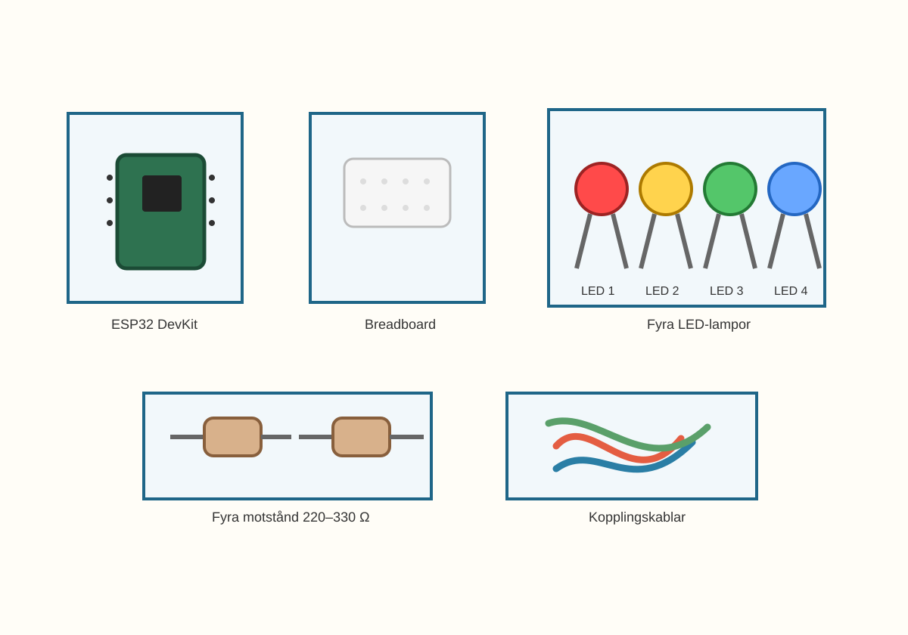
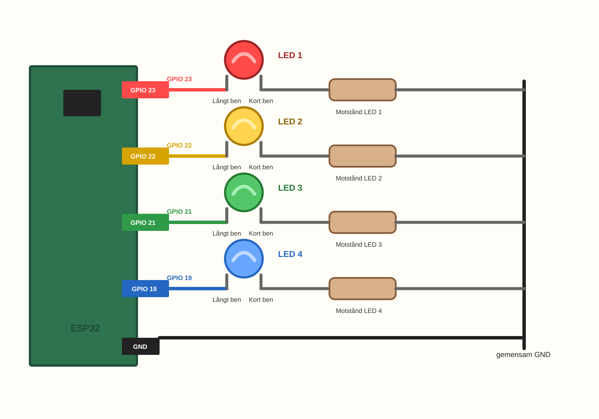
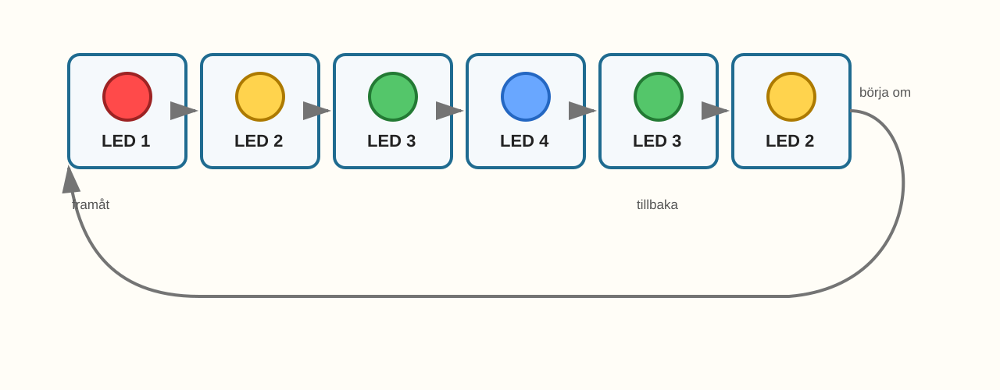
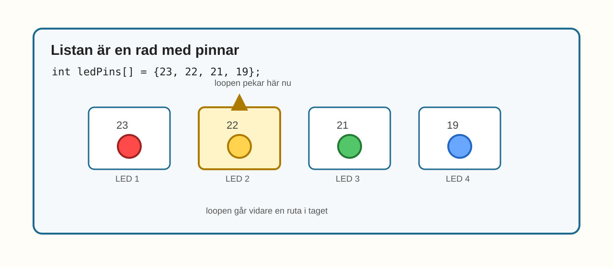

# E008 – Rinnande ljus

## Uppdraget: låt ljuset rinna

I E007 gjorde du en LED-stafett.

Där använde du ett kodrecept:

```cpp
lightOne(redPin);
```

och samma recept kunde användas med olika lampor.

Nu tar vi nästa steg.

I stället för att skriva varje lampa för hand ska koden få gå igenom en liten lista med lampor.

Då kan ljuset se ut som att det rinner längs raden.

> När flera saker ska göras i ordning kan koden följa en lista.

---

## Dagens uppfinning

Du ska bygga ett rinnande ljus med fyra LED-lampor.

Ljuset ska gå åt ena hållet:

> LED 1 → LED 2 → LED 3 → LED 4

Sedan ska det gå tillbaka:

> LED 3 → LED 2

Och sedan börja om.

Det blir som en liten ljusorm som rör sig fram och tillbaka.

Den nya idén är att koden får hjälp av två saker:

- en lista med pinnar,
- en `for`-loop som går igenom listan.

Det kan se lite mer avancerat ut än E007.

Det är okej.

Du behöver inte förstå varje tecken direkt.

Börja med bilden i huvudet:

> listan är en rad med lampor, och loopen går ett steg i taget.

---

## Du lär dig

När du gjort experimentet har du lärt dig att:

- bygga vidare från tre LED till fyra LED,
- samla flera GPIO-pinnar i en liten lista,
- se hur en `for`-loop kan gå ett steg i taget,
- återanvända funktionen `lightOne()`,
- ändra ljusets riktning genom att ändra loopens ordning,
- se hur kortare kod kan skapa ett längre ljusmönster.

---

## Du behöver



_Dagens delar: ESP32, breadboard, fyra LED-lampor, fyra motstånd, kopplingskablar och USB._

| Del | Antal | Kommentar |
|---|---:|---|
| ESP32 DevKit | 1 | Samma som tidigare |
| Breadboard | 1 | Gärna samma som E007 |
| LED-lampor | 4 | Färgerna får vara vilka du vill |
| Motstånd 220–330 Ω | 4 | Ett motstånd per LED |
| Kopplingskablar | 8–10 | Hane–hane |
| USB-kabel | 1 | För ström och uppladdning |

> **Vuxenkoll:** E008 lägger till en fjärde LED jämfört med E007. Kontrollera att även den nya LED-lampan har eget motstånd.

---

## Innan du börjar

Om du har kvar E007-kopplingen kan du använda den som start.

Då behöver du bara lägga till en fjärde LED.

I det här experimentet använder vi:

- LED 1 på GPIO 23,
- LED 2 på GPIO 22,
- LED 3 på GPIO 21,
- LED 4 på GPIO 19.

Du kan använda olika färger, eller fyra LED-lampor med samma färg.

Det viktiga är ordningen.

---

# Koppla så här

Bygg fyra ljusvägar.



_Förenklad kopplingsöversikt: fyra LED-lampor styrs från varsin GPIO-pinne. Varje LED har eget motstånd till GND._

Koppla så här:

> GPIO 23 → LED 1 långt ben → LED 1 kort ben → motstånd → GND

> GPIO 22 → LED 2 långt ben → LED 2 kort ben → motstånd → GND

> GPIO 21 → LED 3 långt ben → LED 3 kort ben → motstånd → GND

> GPIO 19 → LED 4 långt ben → LED 4 kort ben → motstånd → GND

> **Byggtips:** Börja med E007-kopplingen. Lägg sedan till den fjärde LED-lampan sist. Då blir det lättare att hitta fel.

---

## Snabb kopplingskontroll

Följ varje LED med fingret:

- GPIO → långt ben,
- kort ben → motstånd,
- motstånd → GND.

Gör kontrollen fyra gånger.

En gång per LED.

> **Mikrokoll:** Om en LED sitter baklänges kan den vara helt mörk även om koden är rätt.

---

# Koden

Den här koden ser lite annorlunda ut.

Den har en lista:

```cpp
int ledPins[] = {23, 22, 21, 19};
```

Listan berättar vilka pinnar som hör till lamporna.

Du kan tänka på listan som fyra små rutor i rad:

> första rutan, nästa ruta, nästa ruta, sista rutan.

Sedan får en `for`-loop flytta sig genom rutorna.

Det viktiga just nu är inte att förstå alla tecken i loopen.

Det viktiga är att se vad den gör med lamporna.

Skriv in eller ersätt koden med denna:

```cpp
int ledPins[] = {23, 22, 21, 19};
const int ledCount = 4;

void setup() {
  for (int i = 0; i < ledCount; i++) {
    pinMode(ledPins[i], OUTPUT);
  }
}

void lightOne(int pin) {
  for (int i = 0; i < ledCount; i++) {
    digitalWrite(ledPins[i], LOW);
  }

  digitalWrite(pin, HIGH);
  delay(250);
}

void loop() {
  for (int i = 0; i < ledCount; i++) {
    lightOne(ledPins[i]);
  }

  for (int i = ledCount - 2; i > 0; i--) {
    lightOne(ledPins[i]);
  }
}
```

Titta inte för länge på alla tecken direkt.

Börja med att hitta listan och orden `for`.

Listan visar vilka lampor som finns.

`for` betyder ungefär:

> gör detta för flera saker i rad.

Den andra `for`-loopen ser lite knepig ut.

Den får ljuset att gå tillbaka utan att ytterlamporna tänds två gånger direkt efter varandra.

## Stanna och gissa

Titta på den här raden:

```cpp
int ledPins[] = {23, 22, 21, 19};
```

Vilken ordning tror du lamporna ligger i?

Titta sedan på:

```cpp
for (int i = 0; i < ledCount; i++)
```

Det är okej om raden ser svår ut.

Gissa bara vad den verkar göra med raden av lampor:

- börjar den vid första lampan?
- går den vidare till nästa?
- slutar den efter sista?

Du behöver inte kunna förklara `i` än.

Ladda sedan upp koden.

> **Vuxenkoll:** `for`-loopen är ett stort kodsteg. Målet är inte att barnet ska kunna formulera loopregeln abstrakt. Målet är att barnet ser att koden går igenom listan en sak i taget.

---

# Nu händer det

Titta på LED-raden.

Ljuset ska röra sig så här:

> LED 1 → LED 2 → LED 3 → LED 4 → LED 3 → LED 2 → LED 1 ...



_Sekvensen i E008: ljuset rör sig framåt och tillbaka längs LED-raden._

Det ser inte ut som ett trafikljus längre.

Det ser mer ut som rörelse.

---

# Vad händer egentligen?

I E007 skrev du vilken lampa som skulle lysa:

```cpp
lightOne(redPin);
lightOne(yellowPin);
lightOne(greenPin);
```

I E008 ligger lamporna i en lista:

```cpp
int ledPins[] = {23, 22, 21, 19};
```

Du kan tänka att listan är en liten rad med lådor:



_Kodlistan: loopen pekar på en pinne i taget._

När `i` är `0` pekar loopen på första lådan.

När `i` är `1` pekar den på nästa låda.

När `i` är `2` pekar den på nästa.

När `i` är `3` pekar den på sista.

I koden står det:

```cpp
ledPins[i]
```

Det betyder ungefär:

> ta pinnen i den ruta som loopen pekar på just nu.

> En loop kan göra samma sak flera gånger utan att vi skriver samma rad många gånger.

---

# Testa

Ändra tiden i `lightOne()` från:

```cpp
delay(250);
```

till:

```cpp
delay(500);
```

Ladda upp igen.

Vad händer med ljusormen?

Ändra sedan till:

```cpp
delay(120);
```

Blir den lättare eller svårare att följa med ögonen?

---

# Utforska

Ändra ordningen i listan:

```cpp
int ledPins[] = {23, 22, 21, 19};
```

Prova till exempel:

```cpp
int ledPins[] = {19, 21, 22, 23};
```

Vad händer?

Du har inte flyttat några kablar.

Du har bara ändrat listan.

Ändå rör sig ljuset åt andra hållet.

Det visar något viktigt:

> listans ordning kan styra ljusets ordning.

---

# Experimentera

Prova att göra ett eget rinnande mönster.

| Idé | Testa |
|---|---|
| Långsam ljusorm | höj `delay()` |
| Snabb ljusorm | sänk `delay()` |
| Baklänges från början | byt ordning i listan |
| Hoppande ljus | ändra listan så pinnarna inte ligger i fysisk ordning |
| Bara framåt | ta bort den andra `for`-loopen |

Ändra bara en sak i taget.

Då är det lättare att se vad som gjorde skillnad.

---

# Utmaning

Välj en nivå.

## Nivå 1 – Långsam ljusorm

Gör ljuset så långsamt att du tydligt kan peka på varje LED innan nästa tänds.

---

## Nivå 2 – Snabb ljusorm

Gör ljuset så snabbt att det nästan ser ut som en linje.

Vad händer om det går för snabbt?

---

## Nivå 3 – Fem lampor

Det här är en vuxnare utmaning.

Lägg till en femte LED på en ny GPIO-pinne.

Då behöver du ändra två saker:

1. listan `ledPins[]`,
2. värdet `ledCount`.

Du behöver också ge den nya LED-lampan ett eget motstånd.

> Tips: gör inte denna nivå förrän fyra LED fungerar stabilt. Hoppa över nivån om det känns rörigt.

---

# Vanliga ledtrådar

| Det du ser | Möjlig ledtråd | Testa |
|---|---|---|
| En LED i raden lyser aldrig | Den LED:en kan sitta fel eller saknas i listan | Kontrollera både koppling och `ledPins[]` |
| Fel fysisk ordning | Listan matchar inte hur lamporna sitter | Ändra ordningen i `ledPins[]` |
| Koden kompilerar inte | Hakparenteser `[]`, klamrar `{}` eller semikolon kan saknas | Jämför listan och looparna noga |
| Alla lampor verkar blinka konstigt | `lightOne()` kanske inte släcker alla först | Kontrollera den första `for`-loopen i funktionen |
| Ljuset går bara åt ett håll | Den andra `for`-loopen kan saknas | Kontrollera delen efter första loopen |
| Det går för snabbt | `delay()` är lågt | Testa `400` eller `500` |

> **Vuxenkoll:** Vid felsökning är det klokt att först kontrollera att alla LED går att tända en i taget. Därefter kan ni titta på listan och looparna.

---

# För den vuxne

E008 introducerar två viktiga programmeringsidéer:

- array/lista över pinnar,
- `for`-loop över listan.

Det är ett större kodsteg än E007, men det hålls konkret genom att allt handlar om en fysisk rad med LED-lampor.

Förklara gärna med fingret:

- peka på första värdet i listan,
- peka på första LED-lampan,
- flytta ett steg,
- peka på nästa värde och nästa LED.

Undvik att göra detta till en abstrakt programmeringslektion. Barnet ska främst uppleva:

> koden kan gå igenom en rad med saker.

Den baklänges `for`-loopen kan vänta. Förklara den bara om barnet undrar. Den finns för att ljuset ska vända utan att ytterlamporna blinkar två gånger i rad.

Bra frågor:

- Var finns listan med lampor?
- Hur många lampor finns i listan?
- Vad händer om listan byter ordning?
- Var bestäms hastigheten?
- Var går koden tillbaka åt andra hållet?

---

# Jag undrar...

Fundera på de här frågorna:

- Kan en lista i kod likna en rad med saker på bordet?
- Vad händer om listan och verkligheten inte har samma ordning?
- Kan en loop användas för ljud också?
- Kan en ljusorm ha fler än fyra lampor?
- Vad skulle hända om två lampor fick lysa samtidigt?

Du behöver inte svara på allt nu.

Flera frågor kommer tillbaka när vi gör ljus som tonar och byter färg.

---

# Nästa experiment

Nu har du fått ljus att röra sig med en lista och en loop.

Du har också sett att flera LED-lampor kan samarbeta som en rad.

I nästa experiment byter vi till en ny sorts LED.

Den ser ut som en enda lampa, men den gömmer flera färger.

Då händer något nytt:

> En LED kan innehålla rött, grönt och blått ljus.
