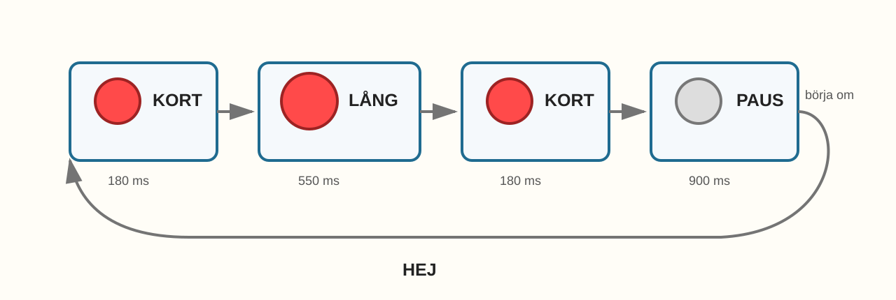
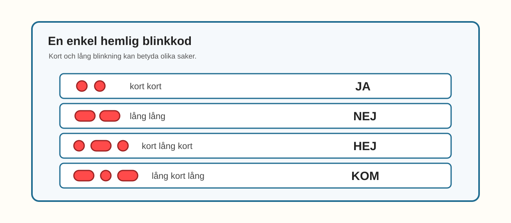

# E009 – Hemlig blinkkod

## Bonusuppdrag: skicka ett meddelande med ljus

I E008 fick ljuset röra sig fram och tillbaka.

Nu gör vi något annat med ljuset.

Vi låter en LED-lampa skicka ett hemligt meddelande.

Det här är ett bonusprojekt.

Det betyder att du kan göra det när du vill prova något lekfullt med blinkningar.

Du behöver inte göra det för att gå vidare till RGB och färg.

> Ett blink kan vara mer än ett blink. Det kan vara ett tecken.

---

## Dagens uppfinning

Du ska göra en hemlig blinkkod.

Koden använder bara en LED-lampa.

Den kan blinka:

- kort,
- långt,
- pausa.

Sedan kan du bestämma vad blinkningarna betyder.

I det här experimentet betyder:

| Blinkkod | Hemlig betydelse |
|---|---|
| kort kort | JA |
| lång lång | NEJ |
| kort lång kort | HEJ |
| lång kort lång | KOM |

Det här är inte riktig Morse-kod.

Det är din egen enkla hemliga kod.

---

## Du lär dig

När du gjort bonusprojektet har du lärt dig att:

- återanvända en enkel LED-koppling,
- göra korta och långa blinkningar,
- använda funktioner för olika blinktyper,
- skapa ett mönster som betyder något,
- tänka på paus som en del av meddelandet,
- felsöka om meddelandet går för snabbt eller för långsamt.

---

## Du behöver


_Dagens delar: en ESP32, en LED, ett motstånd, breadboard, kablar och USB._

| Del | Antal | Kommentar |
|---|---:|---|
| ESP32 DevKit | 1 | Samma som tidigare |
| Breadboard | 1 | Samma som tidigare |
| LED-lampa | 1 | Vilken färg du vill |
| Motstånd 220–330 Ω | 1 | Ett motstånd till LED-lampan |
| Kopplingskablar | 2–4 | Hane–hane |
| USB-kabel | 1 | För ström och uppladdning |

> **Vuxenkoll:** E009 är ett bonusprojekt enligt Kapitel 2-strukturen. Det är medvetet enklare i kopplingen och fokuserar på betydelse, rytm och funktioner.

---

## Innan du börjar

Du kan bygga detta som en ny enkel LED-koppling.

Eller så kan du använda LED 1 från E008 om den redan sitter på GPIO 23.

I det här experimentet använder vi:

- LED på GPIO 23.

---

# Koppla så här

Koppla en LED-lampa med ett motstånd.


_Förenklad kopplingsöversikt: GPIO 23 går till LED-lampans långa ben. LED-lampans korta ben går via motstånd till GND._

Kopplingsvägen är:

> GPIO 23 → LED långt ben → LED kort ben → motstånd → GND

> **Byggtips:** Om du använder en LED från E008, välj LED 1 på GPIO 23 och låt de andra lamporna vara kvar men oanvända.

---

## Snabb kopplingskontroll

Följ vägen med fingret:

- GPIO 23 till LED-lampans långa ben,
- LED-lampans korta ben till motstånd,
- motstånd till GND.

> **Mikrokoll:** Om lampan inte blinkar alls, kontrollera först LED-riktningen och motståndet.

---

# Koden

Nu använder vi tre små kodrecept:

- `shortBlink()` för kort blink,
- `longBlink()` för långt blink,
- `pauseBetweenMessages()` för en längre paus.

Skriv in eller ersätt koden med denna:

```cpp
const int ledPin = 23;

void setup() {
  pinMode(ledPin, OUTPUT);
}

void shortBlink() {
  digitalWrite(ledPin, HIGH);
  delay(180);
  digitalWrite(ledPin, LOW);
  delay(180);
}

void longBlink() {
  digitalWrite(ledPin, HIGH);
  delay(550);
  digitalWrite(ledPin, LOW);
  delay(180);
}

void pauseBetweenMessages() {
  delay(900);
}

void loop() {
  // HEJ: kort lång kort
  shortBlink();
  longBlink();
  shortBlink();

  pauseBetweenMessages();
}
```

## Stanna och gissa

Titta på dessa rader:

```cpp
shortBlink();
longBlink();
shortBlink();
```

Vilken blinkkod tror du att LED-lampan skickar?

Titta i tabellen ovan.

Vilket hemligt ord betyder det?

Ladda sedan upp koden.

> **Vuxenkoll:** Det viktiga här är inte att lära ut Morse-kod, utan att visa att tid och paus kan bära betydelse. E010 kan senare hantera riktig Morse om ni vill.

---

# Nu händer det

Titta på lampan.

Den ska blinka:

> kort → lång → kort → paus → kort → lång → kort → paus ...



_Blinkkoden i E009: kort, lång, kort och sedan en tydlig paus._

Om du följer med med fingret kan du läsa meddelandet:

> HEJ

---

# Vad händer egentligen?

I tidigare experiment blinkade lampan mest för att skapa rytm eller rörelse.

Nu får blinkningarna betydelse.

En kort blinkning kan betyda en sak.

En lång blinkning kan betyda något annat.

Och pausen visar var meddelandet slutar.



_En enkel hemlig blinkkod. Du kan ändra vad koderna betyder._

Det viktiga är inte att koden är hemlig på riktigt.

Det viktiga är att ljus kan användas som tecken.

---

# Testa

Ändra meddelandet från HEJ till JA.

Byt ut innehållet i `loop()` mot detta:

```cpp
void loop() {
  // JA: kort kort
  shortBlink();
  shortBlink();

  pauseBetweenMessages();
}
```

Ladda upp igen.

Kan du se skillnaden?

---

# Utforska

Prova ett annat meddelande.

| Meddelande | Blinkkod | Kod i `loop()` |
|---|---|---|
| JA | kort kort | `shortBlink(); shortBlink();` |
| NEJ | lång lång | `longBlink(); longBlink();` |
| HEJ | kort lång kort | `shortBlink(); longBlink(); shortBlink();` |
| KOM | lång kort lång | `longBlink(); shortBlink(); longBlink();` |

Skriv bara om raderna i `loop()`.

Låt funktionerna vara som de är.

---

# Experimentera

Skapa en egen hemlig kod.

Bestäm först vad blinkningarna betyder.

| Din kod | Betyder |
|---|---|
| kort lång |  |
| lång kort |  |
| kort kort lång |  |
| lång lång kort |  |

Testa sedan om någon annan kan läsa din kod.

Säg inte svaret direkt.

Låt personen gissa.

---

# Utmaning

Välj en nivå.

## Nivå 1 – Långsammare meddelande

Gör både kort och lång blinkning lite långsammare.

Blir det lättare att läsa?

---

## Nivå 2 – Eget ord

Skapa ett eget ord med tre blinkningar.

Skriv först upp vad ordet betyder.

Ändra sedan raderna i `loop()`.

---

## Nivå 3 – Två meddelanden

Det här är en vuxnare utmaning.

Skicka två meddelanden efter varandra.

Till exempel:

> HEJ  
> JA

Använd en extra lång paus mellan meddelandena så att man hinner läsa.

---

# Vanliga ledtrådar

| Det du ser | Möjlig ledtråd | Testa |
|---|---|---|
| Alla blink ser lika långa ut | Kort och lång tid ligger för nära varandra | Öka skillnaden mellan `180` och `550` |
| Meddelandet går för snabbt | Pauserna är för korta | Höj pausen efter varje blink eller mellan meddelanden |
| Lampan blinkar inte | LED, motstånd eller GPIO kan vara fel | Följ kopplingsvägen från GPIO 23 till GND |
| Koden kompilerar inte | En parentes, klammer eller semikolon saknas | Jämför funktionerna rad för rad |
| Det är svårt att läsa koden | Meddelandet kanske saknar paus | Kontrollera `pauseBetweenMessages()` |

> **Vuxenkoll:** Om barnet vill göra långa meddelanden blir koden snabbt upprepande. Håll E009 lekfullt. Långa eller riktiga kodsystem passar bättre som E010 eller senare bonusmaterial.

---

# För den vuxne

E009 är producerat som bonusprojekt.

Det är inte tänkt att vara ett huvudsteg mot PWM.

Det har ändå pedagogiskt värde eftersom barnet får uppleva att:

- blinktid kan bära betydelse,
- paus är en del av ett meddelande,
- funktioner kan göra kod mer läsbar,
- elektronik kan användas för enkel kommunikation.

Undvik att göra det till en lektion om riktig Morse-kod.

Bra frågor:

- Vilken blinkning är kort?
- Vilken blinkning är lång?
- Var ser man att meddelandet börjar om?
- Varför behövs pausen?
- Kan någon annan läsa din kod?

---

# Jag undrar...

Fundera på de här frågorna:

- Kan ljus vara ett språk?
- Hur lång måste en paus vara för att man ska hinna förstå?
- Kan två personer komma överens om en hemlig kod?
- Vad händer om mottagaren inte vet vad koden betyder?
- Skulle ljud kunna fungera på samma sätt?

Du behöver inte svara på allt nu.

---

# Nästa experiment

Det här var ett bonusprojekt.

När du vill gå vidare i huvudspåret fortsätter Kapitel 2 mot färg och RGB.

Då händer något nytt:

> En LED kan ha flera färger i samma lilla kapsel.
