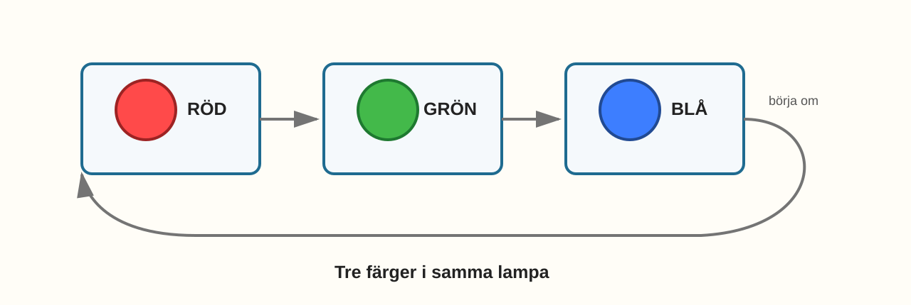
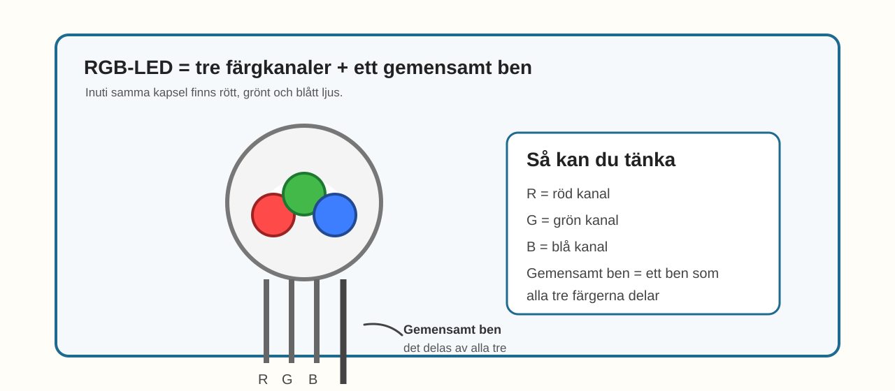

# E011 – RGB: tre färger i en LED

## Uppdraget: upptäck tre färger i samma lampa

Hittills har du använt vanliga LED-lampor.

Varje lampa har haft en färg.

Nu ska du prova något nytt.

Du ska använda en **RGB-LED**.

Det är en enda liten lampa som kan lysa i **rött, grönt och blått**.

Det betyder att en enda lampa egentligen gömmer tre små ljus.

> En RGB-LED är som tre lampor i samma lilla kapsel.

---

## Dagens uppfinning

Du ska koppla en RGB-LED till tre GPIO-pinnar.

Varje färg får en egen väg:

- röd,
- grön,
- blå.

Sedan ska du ladda upp kod som tänder en färg i taget.

Först rött.

Sedan grönt.

Sedan blått.

Du ska alltså inte blanda färger ännu.

Det gör vi i nästa experiment.

I dag är målet att förstå den stora idén:

> en RGB-LED är en lampa med tre färgkanaler.

---

## Du lär dig

När du gjort experimentet har du lärt dig att:

- en RGB-LED innehåller rött, grönt och blått ljus,
- en RGB-LED har ett gemensamt ben och tre färgben,
- varje färg behöver ett eget motstånd,
- tre GPIO-pinnar kan styra en enda RGB-LED,
- samma lampa kan visa olika färger utan att du byter komponent,
- färgblandning kommer från att flera färgkanaler kan lysa tillsammans.

---

## Du behöver


_Dagens delar: ESP32, breadboard, en RGB-LED, tre motstånd, kopplingskablar och USB._

| Del | Antal | Kommentar |
|---|---:|---|
| ESP32 DevKit | 1 | Samma som tidigare |
| Breadboard | 1 | Samma som tidigare |
| RGB-LED | 1 | En LED med röd, grön och blå del |
| Motstånd 220–330 Ω | 3 | Ett motstånd per färgkanal |
| Kopplingskablar | 6–8 | Hane–hane |
| USB-kabel | 1 | För ström och uppladdning |

> **Vuxenkoll:** E011 utgår från en **common cathode RGB-LED** i projektets standardbild. Det betyder att det gemensamma benet går till GND.

---

## Innan du börjar

Det här experimentet bygger vidare på att du redan vet hur en vanlig LED fungerar.

Skillnaden nu är att RGB-LED-lampan har fler ben.

I det här experimentet använder vi:

- röd kanal på GPIO 23,
- grön kanal på GPIO 22,
- blå kanal på GPIO 21.

Det gemensamma benet går till GND.

Varje färgkanal får sitt eget motstånd.

---

# Koppla så här

Bygg tre färgvägar till samma RGB-LED.


_Förenklad kopplingsöversikt: tre GPIO-pinnar styr röd, grön och blå kanal. RGB-LED:ens gemensamma ben går till GND._

Koppla så här:

> GPIO 23 → motstånd → rött ben på RGB-LED

> GPIO 22 → motstånd → grönt ben på RGB-LED

> GPIO 21 → motstånd → blått ben på RGB-LED

> gemensamt ben på RGB-LED → GND

> **Byggtips:** Följ bara en färg i taget när du kopplar. Börja gärna med rött, sedan grönt, sedan blått.

---

## Snabb kopplingskontroll

Följ varje färgväg med fingret:

- GPIO 23 till motstånd och vidare till rött ben,
- GPIO 22 till motstånd och vidare till grönt ben,
- GPIO 21 till motstånd och vidare till blått ben,
- gemensamt ben till GND.

Tänk tre vägar in.

En väg ut.

> **Mikrokoll:** Om bara en eller två färger fungerar kan ett av färgbenen eller motstånden sitta fel även om resten är rätt.

---

# Koden

Nu ska du tända en färg i taget.

Vi använder tre pin-variabler:

```cpp
const int redPin = 23;
const int greenPin = 22;
const int bluePin = 21;
```

De talar om vilken pinne som styr vilken färg.

Skriv in eller ersätt koden med denna:

```cpp
const int redPin = 23;
const int greenPin = 22;
const int bluePin = 21;

void setup() {
  pinMode(redPin, OUTPUT);
  pinMode(greenPin, OUTPUT);
  pinMode(bluePin, OUTPUT);
}

void allOff() {
  digitalWrite(redPin, LOW);
  digitalWrite(greenPin, LOW);
  digitalWrite(bluePin, LOW);
}

void loop() {
  allOff();
  digitalWrite(redPin, HIGH);
  delay(700);

  allOff();
  digitalWrite(greenPin, HIGH);
  delay(700);

  allOff();
  digitalWrite(bluePin, HIGH);
  delay(700);
}
```

Det här är medvetet enkel kod.

Målet är inte att skriva avancerat.

Målet är att se att samma lampa kan bli olika färger.

## Stanna och gissa

Titta på dessa rader:

```cpp
allOff();
digitalWrite(redPin, HIGH);
```

Vilken färg tror du att lampan visar då?

Och vad händer om du i stället använder `greenPin` eller `bluePin`?

Gissa först.

Ladda sedan upp koden.

---

# Nu händer det

Lampan ska visa en färg i taget:

> röd → grön → blå → röd → grön → blå ...



_Samma RGB-LED lyser först rött, sedan grönt, sedan blått._

Du byter alltså inte lampa.

Det är samma lilla kapsel hela tiden.

Det är det som gör RGB-LED-lampan speciell.

---

# Vad händer egentligen?

En vanlig LED har bara en ljusdel.

En RGB-LED har tre ljusdelar inuti:

- en röd,
- en grön,
- en blå.

De delar på ett gemensamt ben.

När du tänder en kanal lyser just den färgen.

När du senare tänder flera kanaler samtidigt kan färger blandas.

Men i E011 håller vi det enkelt:

> en färg i taget.



_R, G och B bor i samma lilla LED-lampa. Det gemensamma benet delas av alla tre._

---

# Testa

Testa att låta lampan bara visa rött.

Ändra `loop()` till:

```cpp
void loop() {
  allOff();
  digitalWrite(redPin, HIGH);
}
```

Vad händer nu?

Testa sedan grönt.

Testa sedan blått.

---

# Utforska

Byt ordning på färgerna.

Till exempel:

> blå → röd → grön

Det gör du bara genom att byta ordning på raderna i `loop()`.

Du kan också prova att göra en färg längre än de andra genom att ändra en `delay()`.

---

# Experimentera

Gör en liten färgshow.

Till exempel:

- röd två gånger,
- sedan grön,
- sedan blå,
- sedan börja om.

Kan du få lampan att kännas glad?

Eller lugn?

Eller snabb?

---

# Utmaning

Välj en nivå.

## Nivå 1 – Egen färgordning

Bestäm en egen ordning med tre eller fyra steg.

Skriv ordningen först.

Koda den sedan.

---

## Nivå 2 – Snabbare färger

Minska alla `delay(700)` till `delay(300)`.

Hur känns lampan nu?

---

## Nivå 3 – Två färger samtidigt

Det här är en smygtitt på nästa experiment.

Prova att tända två färger samtidigt.

Till exempel:

```cpp
digitalWrite(redPin, HIGH);
digitalWrite(greenPin, HIGH);
```

Vilken färg tycker du att du ser?

Du behöver inte förstå allt ännu.

Det viktiga är att du märker att något nytt händer.

---

# Vanliga ledtrådar

| Det du ser | Möjlig ledtråd | Testa |
|---|---|---|
| Inget lyser alls | Gemensamt ben eller GND kan vara fel | Kontrollera RGB-LED:ens gemensamma ben först |
| Bara en färg fungerar | En färgkanal eller ett motstånd sitter fel | Följ just den färgens väg från GPIO till RGB-ben |
| Färgerna verkar byta plats | Färgbenen kan vara kopplade i annan ordning | Jämför noga med kopplingsbilden |
| Färgen är mycket svag | Dålig kontakt eller fel motstånd | Tryck till komponenter och kontrollera motstånd |
| Koden kompilerar inte | Något tecken saknas | Jämför rad för rad |

> **Vuxenkoll:** Om barnet använder en annan RGB-LED-typ än common cathode kan beteendet avvika. Följ projektets standardbild eller verifiera benordning mot datablad.

---

# För den vuxne

E011 är första tydliga RGB-steget.

Det viktiga här är inte PWM eller exakta färgvärden.

Det viktiga är att barnet får uppleva tre saker:

- en lampa kan innehålla flera färgkanaler,
- varje kanal behöver egen styrning,
- färgblandning blir möjlig därför att kanalerna finns samtidigt i samma komponent.

Bra frågor att ställa:

- Hur många färger bor i lampan?
- Varför behövs tre GPIO-pinnar?
- Vilket ben är gemensamt?
- Varför har varje färg sitt eget motstånd?
- Vad tror du händer om två färger tänds samtidigt?

---

# Jag undrar...

Fundera på de här frågorna:

- Varför räcker just rött, grönt och blått?
- Hur kan tre färger bli många fler färger?
- Är en RGB-LED en lampa eller tre lampor?
- Varför delar färgerna ett gemensamt ben?
- Var i vardagen finns RGB-ljus?

Du behöver inte svara på allt nu.

---

# Nästa experiment

Nu vet du att tre färger bor i samma lampa.

Nästa steg blir att blanda dem mer medvetet.

Då ska du få prova något nytt:

> att styra hur mycket varje färg lyser.
