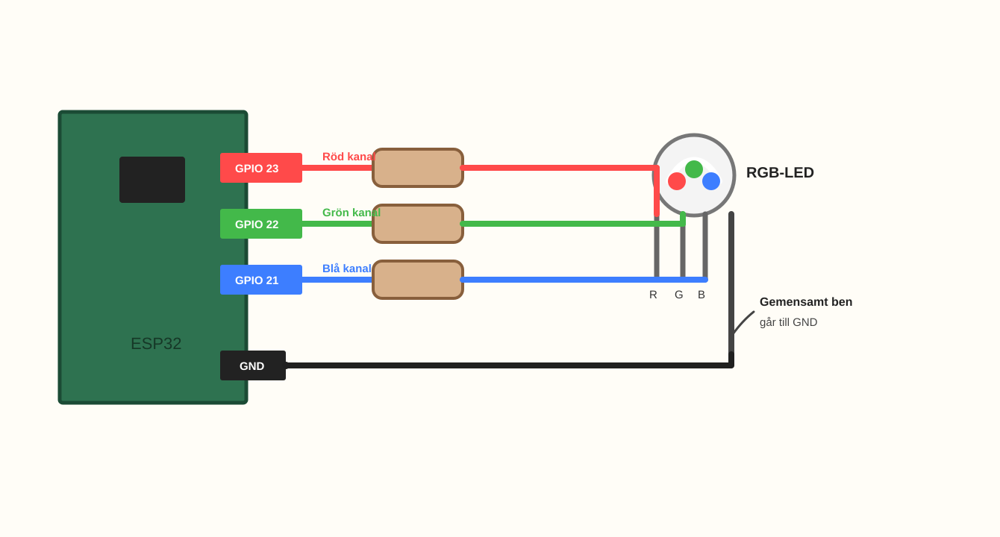
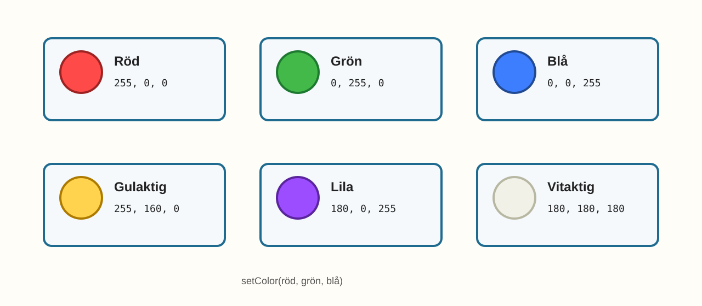
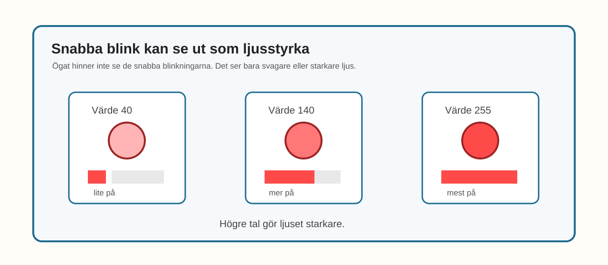

# E012 – Färgblandaren

## Uppdraget: blanda färger med ljusstyrka

I E011 upptäckte du att en RGB-LED har tre färger i samma lampa:

- röd,
- grön,
- blå.

Då tände vi en färg i taget.

Nu ska vi göra något nytt.

Vi ska styra **hur starkt** varje färg lyser.

Då kan färgerna blandas.

> Om rött och grönt lyser samtidigt kan lampan se gulaktig ut.

---

## Dagens uppfinning

Du ska göra en färgblandare.

Du använder samma RGB-LED-koppling som i E011.

Men koden ändras.

I stället för bara `HIGH` och `LOW` använder vi värden mellan:

> 0 och 255

Där betyder:

- `0` inget ljus,
- `255` fullt ljus,
- värden däremellan blir svagare eller starkare ljus.

Det nya ordet är **PWM**.

Du behöver inte förstå hur PWM fungerar helt ännu.

Börja med att tänka så här:

> ett högre tal gör färgen starkare.

---

## Du lär dig

När du gjort experimentet har du lärt dig att:

- återanvända RGB-LED-kopplingen från E011,
- styra hur starkt rött, grönt och blått lyser,
- använda värden från 0 till 255,
- blanda enkla färger med tre färgkanaler,
- förstå PWM som “snabbt blink som ser ut som svagare ljus”,
- göra egna färgrecept i kod.

---

## Du behöver


_Dagens delar: samma delar som E011 – ESP32, breadboard, en RGB-LED, tre motstånd, kopplingskablar och USB._

| Del | Antal | Kommentar |
|---|---:|---|
| ESP32 DevKit | 1 | Samma som tidigare |
| Breadboard | 1 | Samma som E011 |
| RGB-LED | 1 | Projektets standard: common cathode |
| Motstånd 220–330 Ω | 3 | Ett motstånd per färgkanal |
| Kopplingskablar | 6–8 | Hane–hane |
| USB-kabel | 1 | För ström och uppladdning |

> **Vuxenkoll:** E012 använder samma standardkoppling som E011: common cathode RGB-LED med gemensamt ben till GND.

---

## Innan du börjar

Om du har kvar kopplingen från E011 kan du använda den igen.

I det här experimentet använder vi samma pinnar:

- röd kanal på GPIO 23,
- grön kanal på GPIO 22,
- blå kanal på GPIO 21.

Det gemensamma benet går till GND.

Varje färgkanal har eget motstånd.

---

# Koppla så här

Kopplingen är samma som i E011.



_Förenklad kopplingsöversikt: samma RGB-LED-koppling som E011. Tre färgkanaler och ett gemensamt ben till GND._

Kopplingsvägarna är:

> GPIO 23 → motstånd → rött ben på RGB-LED

> GPIO 22 → motstånd → grönt ben på RGB-LED

> GPIO 21 → motstånd → blått ben på RGB-LED

> gemensamt ben på RGB-LED → GND

> **Byggtips:** Eftersom kopplingen är samma som E011 kan du börja med att bara kontrollera den, inte bygga om allt.

---

## Snabb kopplingskontroll

Följ varje väg:

- röd kanal från GPIO 23,
- grön kanal från GPIO 22,
- blå kanal från GPIO 21,
- gemensamt ben till GND.

> **Mikrokoll:** Om färgblandningen ser konstig ut kan en färgkanal vara kopplad till fel ben. Testa gärna röd, grön och blå var för sig först.

---

# Koden

Nu använder vi ett färgrecept.

Receptet heter `setColor()`.

Det har tre tal:

```cpp
setColor(255, 160, 0);
```

Du kan läsa det så här:

> röd, grön, blå

Varje tal kan vara mellan 0 och 255.

Inuti receptet används `analogWrite()` för att styra hur starkt varje färg lyser.

Skriv in eller ersätt koden med denna:

```cpp
const int redPin = 23;
const int greenPin = 22;
const int bluePin = 21;

void setup() {
  pinMode(redPin, OUTPUT);
  pinMode(greenPin, OUTPUT);
  pinMode(bluePin, OUTPUT);
}

void setColor(int red, int green, int blue) {
  analogWrite(redPin, red);
  analogWrite(greenPin, green);
  analogWrite(bluePin, blue);
}

void loop() {
  // Röd
  setColor(255, 0, 0);
  delay(900);

  // Grön
  setColor(0, 255, 0);
  delay(900);

  // Blå
  setColor(0, 0, 255);
  delay(900);

  // Gulaktig: röd + grön
  setColor(255, 160, 0);
  delay(900);

  // Lila: röd + blå
  setColor(180, 0, 255);
  delay(900);

  // Vitaktig: röd + grön + blå
  setColor(180, 180, 180);
  delay(900);
}
```

## Stanna och gissa

Titta på den här raden:

```cpp
setColor(255, 160, 0);
```

Det första talet styr rött.

Det andra talet styr grönt.

Det tredje talet styr blått.

Vilka färger tror du är med?

Vilken färg tror du lampan kan få?

Gissa först.

Ladda sedan upp koden.

> **Vuxenkoll:** `analogWrite()` används här som barnvänlig ingång till PWM. Innan slutversion behöver projektet fatta ett tekniskt beslut: använda `analogWrite()` om vald ESP32/Arduino-version stödjer det stabilt, eller gömma ESP32:s LEDC/PWM-kod bakom samma enkla `setColor()`-idé.

---

# Nu händer det

Lampan ska visa flera olika färger.

Först rena färger:

> röd → grön → blå

Sedan blandade färger:

> gulaktig → lila → vitaktig



_Färgrecept i E012: olika tal för röd, grön och blå ger olika färger._

Färgerna kanske inte blir exakt som på bilden.

Det beror på RGB-LED, motstånd och ljus i rummet.

Det viktiga är att du ser att talen ändrar färgen.

---

# Vad händer egentligen?

I E011 tände du färger med `HIGH`.

Det var ungefär som en vanlig strömbrytare:

> på eller av.

I E012 använder du värden mellan 0 och 255.

Då kan en färg vara av, svag, mellan eller stark.

ESP32 gör detta genom att blinka mycket snabbt.

Så snabbt att ögat inte hinner se blinkningarna.

Ögat ser det som olika ljusstyrka.



_PWM-idén: korta på-stunder ser svagare ut, långa på-stunder ser starkare ut._

Du behöver inte räkna på PWM.

Det räcker att komma ihåg:

> högre tal = starkare ljus.

---

# Testa

Ändra den gulaktiga färgen från:

```cpp
setColor(255, 160, 0);
```

till:

```cpp
setColor(255, 40, 0);
```

Vad händer?

Blir färgen mer röd?

Ändra sedan till:

```cpp
setColor(255, 255, 0);
```

Vad händer då?

---

# Utforska

Prova egna färgrecept.

| Färgidé | Röd | Grön | Blå |
|---|---:|---:|---:|
| Svagt röd | 40 | 0 | 0 |
| Stark röd | 255 | 0 | 0 |
| Mörk lila | 80 | 0 | 120 |
| Kall blå | 0 | 60 | 255 |
| Vitaktig | 180 | 180 | 180 |

Skriv in ett färgrecept i `setColor()` och se vad som händer.

---

# Experimentera

Skapa tre egna färger.

Ge dem namn.

| Namn på färgen | Röd | Grön | Blå |
|---|---:|---:|---:|
|  |  |  |  |
|  |  |  |  |
|  |  |  |  |

Testa sedan att lägga in dem i `loop()`.

Kan du göra en färgshow som känns:

- varm,
- kall,
- magisk,
- lugn?

---

# Utmaning

Välj en nivå.

## Nivå 1 – Gör en egen favoritfärg

Ändra talen tills du hittar en färg du gillar.

Skriv ner färgreceptet.

---

## Nivå 2 – Tre färger i rad

Gör tre egna färger som visas efter varandra.

Använd `delay()` mellan färgerna.

---

## Nivå 3 – Mjuk start

Det här är en smygtitt på nästa experiment.

Prova att ändra en färg lite i taget.

Till exempel:

```cpp
for (int value = 0; value <= 255; value = value + 5) {
  setColor(value, 0, 0);
  delay(30);
}
```

Vad händer med den röda färgen?

Du behöver inte förstå hela loopen ännu.

Titta bara på hur ljuset förändras.

---

# Vanliga ledtrådar

| Det du ser | Möjlig ledtråd | Testa |
|---|---|---|
| Färgerna verkar fel | Färgbenen kan vara kopplade i annan ordning | Testa röd, grön och blå var för sig |
| Alla färger är väldigt svaga | RGB-LED eller motstånd kan dämpa mycket | Testa värdet `255` på en kanal |
| Färgen ändras inte | Koden kanske inte laddades upp | Ladda upp igen och kontrollera vald port |
| Två färger blandas inte | En färgkanal kan sitta fel | Följ den färgens väg från GPIO till RGB-ben |
| Koden kompilerar inte | En parentes eller semikolon kan saknas | Jämför `setColor()` rad för rad |

> **Vuxenkoll:** E012 ska behålla den pedagogiska 0–255-modellen. Om `analogWrite()` inte fungerar stabilt i vald ESP32-miljö bör teknisk granskning byta implementation bakom kulisserna, men helst behålla barnets kodidé med `setColor(red, green, blue)`.

---

# För den vuxne

E012 introducerar PWM genom upplevelse, inte teori.

Barnet ska först märka att:

- talen 0–255 ändrar ljusstyrka,
- tre ljusstyrkor tillsammans blir ett färgrecept,
- färger kan variera även när kopplingen är samma.

Undvik långa förklaringar om frekvens, duty cycle eller timerkanaler här.

Det räcker med:

> ESP32 blinkar så snabbt att ögat ser det som svagare eller starkare ljus.

Bra frågor:

- Vilket tal styr rött?
- Vilket tal styr grönt?
- Vilket tal styr blått?
- Vad händer om ett tal blir större?
- Hur kan du spara en färg du gillar?

---

# Jag undrar...

Fundera på de här frågorna:

- Är färgen i koden samma som färgen du ser?
- Varför kan två RGB-LED-lampor visa lite olika färg?
- Hur många färger går det att hitta?
- Kan en färg kännas varm eller kall?
- Kan ljus visa humör?

Du behöver inte svara på allt nu.

---

# Nästa experiment

Nu har du blandat färger med olika tal.

I nästa experiment låter vi färgerna ändras lite i taget.

Då händer något nytt:

> Lampan kan börja kännas som en regnbåge.
