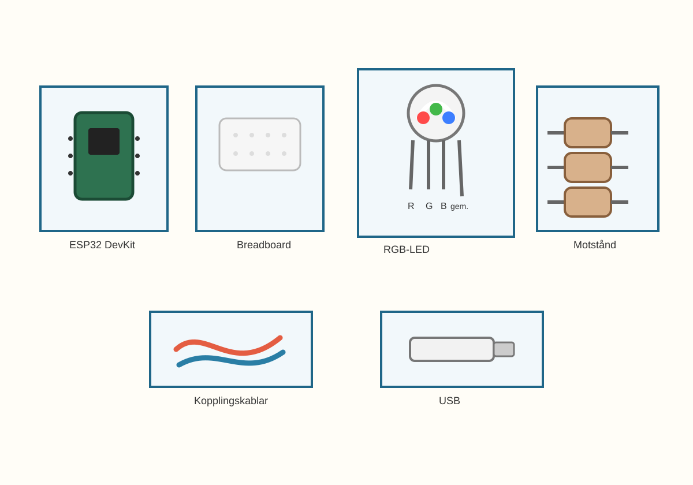
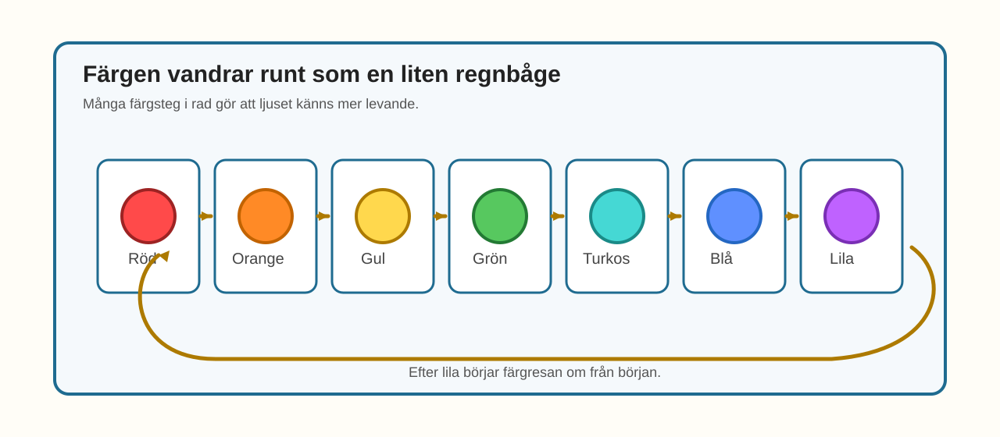
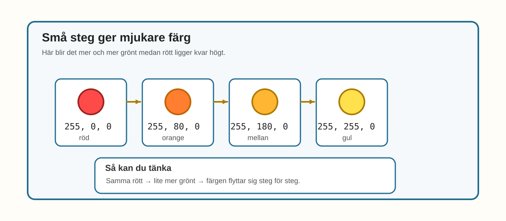

# E013 – Regnbågslampan

## Uppdraget: låt färgerna glida som en regnbåge

I E012 blandade du färger med `setColor()`.

Du provade olika recept:

- röd,
- grön,
- blå,
- blandade färger.

Nu ska du ta nästa steg.

Du ska inte bara byta färg.

Du ska låta färgen **förändras steg för steg**.

När stegen kommer snabbt efter varandra kan lampan kännas som en liten regnbåge.

> Många små steg kan se mjukare ut än några få stora hopp.

---

## Dagens uppfinning

Du ska göra en regnbågslampa.

Du använder samma RGB-LED-koppling som i E011 och E012.

Det nya är koden.

I stället för att visa några enstaka färger låter du färgerna vandra genom flera små steg.

Till exempel:

- röd,
- orange,
- gul,
- grön,
- turkos,
- blå,
- lila,
- rosa.

Den stora idén i dag är:

> om du ändrar RGB-talen lite i taget kan färgen kännas mjukare.

---

## Du lär dig

När du gjort experimentet har du lärt dig att:

- återanvända RGB-LED-kopplingen från E011 och E012,
- skapa en längre färgsekvens med `setColor()`,
- förstå att små ändringar i RGB-värden ger små ändringar i färg,
- använda kortare `delay()` för att få ljuset att kännas mer levande,
- se skillnaden mellan färghopp och mjuka övergångar,
- bygga en enkel regnbågseffekt med kod.

---

## Du behöver



_Dagens delar: samma delar som i E011 och E012 – ESP32, breadboard, en RGB-LED, tre motstånd, kopplingskablar och USB._

| Del | Antal | Kommentar |
|---|---:|---|
| ESP32 DevKit | 1 | Samma som tidigare |
| Breadboard | 1 | Samma som tidigare |
| RGB-LED | 1 | Projektets standard: common cathode |
| Motstånd 220–330 Ω | 3 | Ett motstånd per färgkanal |
| Kopplingskablar | 6–8 | Hane–hane |
| USB-kabel | 1 | För ström och uppladdning |

> **Vuxenkoll:** E013 använder samma standardkoppling som E011 och E012: common cathode RGB-LED med gemensamt ben till GND.

---

## Innan du börjar

Om du har kvar kopplingen från E012 kan du använda den igen.

Vi använder samma pinnar:

- röd kanal på GPIO 23,
- grön kanal på GPIO 22,
- blå kanal på GPIO 21.

Det gemensamma benet går till GND.

Varje färgkanal har eget motstånd.

---

# Koppla så här

Kopplingen är samma som i E011 och E012.


_Förenklad kopplingsöversikt: samma RGB-LED-koppling som tidigare. Tre färgkanaler och ett gemensamt ben till GND._

Kopplingsvägarna är:

> GPIO 23 → motstånd → rött ben på RGB-LED

> GPIO 22 → motstånd → grönt ben på RGB-LED

> GPIO 21 → motstånd → blått ben på RGB-LED

> gemensamt ben på RGB-LED → GND

> **Byggtips:** Eftersom kopplingen är samma som i E012 kan du börja med att kontrollera att alla tre färger fortfarande fungerar var för sig.

---

## Snabb kopplingskontroll

Följ varje färgväg med fingret:

- röd kanal från GPIO 23,
- grön kanal från GPIO 22,
- blå kanal från GPIO 21,
- gemensamt ben till GND.

> **Mikrokoll:** Om en färg saknas i regnbågen beror det ofta på att just den färgkanalen sitter fel eller inte får kontakt.

---

# Koden

Nu ska du använda `setColor()` flera gånger i rad.

Varje rad visar en ny färg.

Skillnaden mot E012 är att färgerna ligger tätare.

Det gör att övergången känns mjukare.

Skriv in eller ersätt koden med denna:

```cpp
const int redPin = 23;
const int greenPin = 22;
const int bluePin = 21;

void setup() {
  pinMode(redPin, OUTPUT);
  pinMode(greenPin, OUTPUT);
  pinMode(bluePin, OUTPUT);
}

void setColor(int red, int green, int blue) {
  analogWrite(redPin, red);
  analogWrite(greenPin, green);
  analogWrite(bluePin, blue);
}

void loop() {
  setColor(255, 0, 0);
  delay(180);

  setColor(255, 80, 0);
  delay(180);

  setColor(255, 180, 0);
  delay(180);

  setColor(255, 255, 0);
  delay(180);

  setColor(80, 255, 0);
  delay(180);

  setColor(0, 255, 0);
  delay(180);

  setColor(0, 255, 140);
  delay(180);

  setColor(0, 120, 255);
  delay(180);

  setColor(0, 0, 255);
  delay(180);

  setColor(120, 0, 255);
  delay(180);

  setColor(220, 0, 255);
  delay(180);

  setColor(255, 0, 120);
  delay(180);
}
```

## Stanna och gissa

Titta på de här två raderna:

```cpp
setColor(255, 0, 0);
setColor(255, 80, 0);
```

Det röda talet är lika stort i båda.

Men det gröna blir större i den andra raden.

Hur tror du att färgen förändras?

Tror du att hoppet blir litet eller stort?

Gissa först.

Ladda sedan upp koden.

> **Vuxenkoll:** E013 bygger vidare på samma pedagogiska modell som E012. `analogWrite()` används som barnvänlig PWM-ingång och behöver fortsatt verifieras mot vald ESP32/Arduino-version.

---

# Nu händer det

Lampan ska vandra genom många färger.

Till exempel:

> röd → orange → gul → grön → turkos → blå → lila → rosa



_E013 visar en längre färgsekvens där RGB-LED-lampan byter färg i många små steg._

Ögat hinner inte tänka "nu är det en helt ny lampa".

I stället känns det mer som att samma lampa vandrar vidare.

---

# Vad händer egentligen?

I E012 bytte du mellan några tydliga färgrecept.

I E013 använder du fler steg.

Varje steg ändrar färgen lite.

Ju fler små steg du lägger in, desto mjukare kan färgresan kännas.

Till exempel:

- samma röda nivå,
- lite mer grönt,
- sedan ännu mer grönt.

Då glider färgen från röd mot orange och gul.



_Begreppsbild för E013: små ändringar i RGB-talen gör att färgen vandrar steg för steg._

Det här är ett bra knep att komma ihåg:

> små ändringar i talen kan ge mjuka ändringar i ljuset.

---

# Testa

Ändra den här raden:

```cpp
delay(180);
```

Prova i stället:

```cpp
delay(400);
```

Vad händer med regnbågen?

Känns den långsammare?

Prova sedan:

```cpp
delay(80);
```

Vad händer då?

---

# Utforska

Här är några extra steg du kan prova.

| Färgidé | Röd | Grön | Blå |
|---|---:|---:|---:|
| Varm orange | 255 | 100 | 0 |
| Citrongul | 255 | 220 | 0 |
| Turkos | 0 | 255 | 180 |
| Klar lila | 180 | 0 | 255 |
| Rosa | 255 | 0 | 140 |

Byt ut en eller två rader i `loop()` och se hur regnbågen förändras.

---

# Experimentera

Gör din egen färgresa.

Du kan till exempel välja fem färger som känns:

- varma,
- kalla,
- lugna,
- festliga.

Skriv ner dem här:

| Namn på färgen | Röd | Grön | Blå |
|---|---:|---:|---:|
|  |  |  |  |
|  |  |  |  |
|  |  |  |  |
|  |  |  |  |
|  |  |  |  |

Kan du få lampan att kännas som:

- soluppgång,
- hav,
- godis,
- rymd?

---

# Utmaning

Välj en nivå.

## Nivå 1 – Gör regnbågen långsammare

Ändra `delay()` så att färgerna hinner stanna längre.

Vilket värde tycker du ser bäst ut?

---

## Nivå 2 – Gör regnbågen baklänges

Prova att skriva färgerna i motsatt ordning.

Vad händer när lampan går:

> rosa → lila → blå → grön → gul → orange → röd

---

## Nivå 3 – Lägg till egna steg

Lägg in minst tre nya `setColor()`-rader mellan färgerna.

Målet är att göra färgresan ännu mjukare.

Titta särskilt på vad som händer när du lägger till steg mellan:

- röd och gul,
- grön och blå,
- blå och lila.

---

# Vanliga ledtrådar

| Det du ser | Möjlig ledtråd | Testa |
|---|---|---|
| Regnbågen visar bara två eller tre färger | En färgkanal kan saknas | Testa röd, grön och blå var för sig |
| Färgerna hoppar för snabbt | `delay()` kan vara för kort | Öka till exempel till `300` eller `400` |
| Färgerna känns hackiga | Du har kanske för få mellansteg | Lägg till fler `setColor()`-rader |
| En färg ser svag ut | RGB-LED eller koppling kan dämpa den kanalen | Testa den färgen ensam med värdet `255` |
| Koden kompilerar inte | En parentes eller semikolon kan saknas | Jämför `setColor()`-raderna rad för rad |

> **Vuxenkoll:** E013 bör tekniskt granskas tillsammans med E012 så PWM-implementeringen blir konsekvent i hela RGB-spåret.

---

# För den vuxne

E013 fördjupar E012 utan att introducera nya komponenter.

Barnet möter här en viktig idé:

- flera små steg kan ge en mjukare känsla,
- kortare pauser ger mer levande rörelse,
- samma koppling kan skapa en helt ny effekt med bara kodändringar.

Det viktiga är inte att barnet kan beskriva hela RGB-logiken exakt.

Det viktiga är att barnet känner igen sambandet:

> ändra talen lite i taget → färgen vandrar lite i taget.

Bra frågor:

- Vilken färg kommer först?
- Vilken färg kommer efter gul?
- Vad gör `delay()` med känslan?
- Hur kan man göra övergången mjukare?
- Vilken färgsekvens känns lugn och vilken känns livlig?

---

# Jag undrar...

Fundera på de här frågorna:

- Hur många steg behövs för att något ska kännas mjukt?
- Kan samma färger kännas olika om de går långsamt eller snabbt?
- Vilken färg tycker du mest ser ut som en regnbåge?
- Kan en lampa kännas glad, lugn eller vild bara genom färgerna?
- Hur skulle du göra en egen färgshow?

Du behöver inte svara på allt nu.

---

# Nästa experiment

Nu kan din RGB-LED glida genom flera färger.

I nästa experiment använder vi färgerna på ett nytt sätt.

Då handlar det inte bara om att färgen är fin.

Då kan färgen också betyda något.

> Lampan kan börja visa humör eller status.
