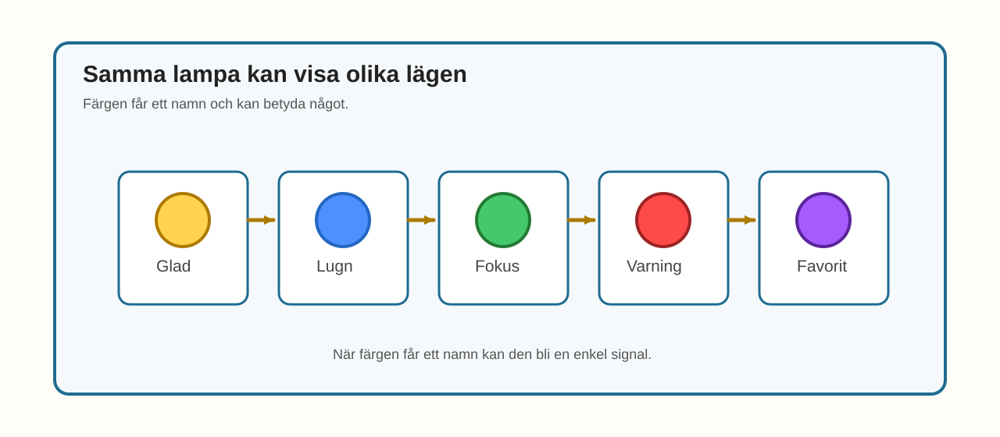
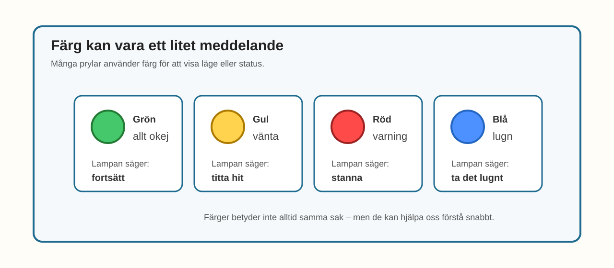

# E014 – Humörlampan

## Uppdraget: låt färgen betyda något

I E013 fick RGB-LED-lampan vandra genom många färger.

Det såg fint ut.

Nu ska färgen få en ny roll.

Den ska inte bara vara fin.

Den ska **berätta något**.

Du ska göra en humörlampa.

Den kan visa till exempel:

- glad,
- lugn,
- fokus,
- varning,
- favoritläge.

> I teknik används färg ofta för att visa läge, känsla eller status.

---

## Dagens uppfinning

Du ska använda samma RGB-LED som tidigare.

Men den här gången bestämmer du vad färgerna betyder.

Till exempel:

| Färg | Betyder |
|---|---|
| Gul | glad |
| Blå | lugn |
| Grön | fokus |
| Röd | varning |
| Lila | favoritläge |

Det nya är inte kopplingen.

Det nya är tanken:

> en färg kan vara ett meddelande.

---

## Du lär dig

När du gjort experimentet har du lärt dig att:

- återanvända RGB-LED-kopplingen från E011–E013,
- använda färg som betydelse eller status,
- ge färgrecept namn i koden,
- förstå att samma ljus kan kännas olika beroende på färg,
- bygga en enkel statuslampa,
- förbereda senare projekt där färger visar vad en pryl gör.

---

## Du behöver


_Dagens delar: samma delar som i E011–E013 – ESP32, breadboard, en RGB-LED, tre motstånd, kopplingskablar och USB._

| Del | Antal | Kommentar |
|---|---:|---|
| ESP32 DevKit | 1 | Samma som tidigare |
| Breadboard | 1 | Samma som tidigare |
| RGB-LED | 1 | Projektets standard: common cathode |
| Motstånd 220–330 Ω | 3 | Ett motstånd per färgkanal |
| Kopplingskablar | 6–8 | Hane–hane |
| USB-kabel | 1 | För ström och uppladdning |

> **Vuxenkoll:** E014 använder samma RGB-LED-koppling som E011–E013. Det är medvetet: barnet ska uppleva att ny betydelse kan skapas med samma hårdvara.

---

## Innan du börjar

Om du har kvar RGB-kopplingen från E013 kan du använda den igen.

Vi använder samma pinnar:

- röd kanal på GPIO 23,
- grön kanal på GPIO 22,
- blå kanal på GPIO 21.

Det gemensamma benet går till GND.

Varje färgkanal har eget motstånd.

---

# Koppla så här

Kopplingen är samma som tidigare.


_Förenklad kopplingsöversikt: samma RGB-LED-koppling som E011–E013. Tre färgkanaler och ett gemensamt ben till GND._

Kopplingsvägarna är:

> GPIO 23 → motstånd → rött ben på RGB-LED

> GPIO 22 → motstånd → grönt ben på RGB-LED

> GPIO 21 → motstånd → blått ben på RGB-LED

> gemensamt ben på RGB-LED → GND

> **Byggtips:** Om lampan fungerade i E013 behöver du troligen inte bygga om. Kontrollera bara att RGB-LED-lampan fortfarande sitter stadigt.

---

## Snabb kopplingskontroll

Testa gärna att tänka:

- röd kanal,
- grön kanal,
- blå kanal,
- gemensamt ben till GND.

> **Mikrokoll:** Om en humörfärg ser fel ut kan färgkanalerna vara blandade. Börja med att testa röd, grön och blå var för sig.

---

# Koden

Nu ska färgerna få namn.

Vi fortsätter använda `setColor()`.

Men vi lägger också till små funktioner som berättar vad färgen betyder.

Skriv in eller ersätt koden med denna:

```cpp
const int redPin = 23;
const int greenPin = 22;
const int bluePin = 21;

void setup() {
  pinMode(redPin, OUTPUT);
  pinMode(greenPin, OUTPUT);
  pinMode(bluePin, OUTPUT);
}

void setColor(int red, int green, int blue) {
  analogWrite(redPin, red);
  analogWrite(greenPin, green);
  analogWrite(bluePin, blue);
}

void glad() {
  setColor(255, 180, 0);
}

void lugn() {
  setColor(0, 80, 255);
}

void fokus() {
  setColor(0, 180, 60);
}

void varning() {
  setColor(255, 0, 0);
}

void favorit() {
  setColor(160, 0, 255);
}

void loop() {
  glad();
  delay(1200);

  lugn();
  delay(1200);

  fokus();
  delay(1200);

  varning();
  delay(1200);

  favorit();
  delay(1200);
}
```

## Stanna och gissa

Titta på den här funktionen:

```cpp
void lugn() {
  setColor(0, 80, 255);
}
```

Vilka färger är med?

Tror du lampan känns varm eller kall?

Gissa först.

Ladda sedan upp koden.

> **Vuxenkoll:** E014 använder fortfarande samma 0–255-modell som E012/E013. Det tekniska beslutet om `analogWrite()` kontra LEDC/PWM behöver granskas samlat för RGB-spåret.

---

# Nu händer det

Lampan visar en känsla i taget:

> glad → lugn → fokus → varning → favorit



_E014 visar färger som fått namn och betydelse._

Titta på lampan.

Känns färgerna olika?

Känns röd mer som varning?

Känns blå mer som lugn?

Det finns inget enda rätt svar.

Det viktiga är att du märker att färg kan skapa känsla.

---

# Vad händer egentligen?

I E012 använde du färger som recept.

I E013 gjorde du en färgresa.

Nu använder du färger som tecken.

En dator, en robot eller en pryl kan använda färg för att visa vad som händer.

Till exempel:

- grön kan betyda att allt är okej,
- röd kan betyda stopp eller varning,
- blå kan betyda lugnt,
- gul kan betyda vänta eller uppmärksamhet.



_Färg kan användas som ett enkelt meddelande: lugn, fokus, varning eller favoritläge._

I E014 bestämmer du själv vad färgerna betyder.

Det kan vara ett humör, men också ett läge.

Till exempel:

> blå = lugn  
> röd = varning  
> lila = favoritläge

> Färgen blir som ett litet språk.

---

# Testa

Byt plats på två humör.

Till exempel:

```cpp
lugn();
delay(1200);

glad();
delay(1200);
```

Känns lampan annorlunda när ordningen ändras?

---

# Utforska

Ändra ett färgrecept.

Till exempel kan du göra `lugn()` mer blå:

```cpp
void lugn() {
  setColor(0, 20, 255);
}
```

Eller mer turkos:

```cpp
void lugn() {
  setColor(0, 180, 180);
}
```

Vilken känns lugnast?

---

# Experimentera

Gör tre egna humör.

Fyll i tabellen först.

| Humör eller läge | Röd | Grön | Blå |
|---|---:|---:|---:|
|  |  |  |  |
|  |  |  |  |
|  |  |  |  |

Skapa sedan egna funktioner i koden.

Exempel:

```cpp
void fest() {
  setColor(255, 40, 180);
}
```

Kan du skapa en färg som känns:

- sömnig,
- superglad,
- hemlig,
- robotaktig?

---

# Utmaning

Välj en nivå.

## Nivå 1 – Välj din favorit

Ta bort alla humör utom ett.

Låt lampan visa din favoritfärg hela tiden.

---

## Nivå 2 – Gör en statuslampa

Bestäm tre lägen:

| Läge | Färg |
|---|---|
| Allt okej |  |
| Vänta |  |
| Varning |  |
| Favoritläge |  |

Ändra koden så lampan visar dem i ordning.

---

## Nivå 3 – Humör med blink

Låt ett humör blinka.

Till exempel kan `varning()` visas två gånger snabbt.

Det här är en smygtitt på senare projekt där lampor kan larma eller signalera status.

---

# Vanliga ledtrådar

| Det du ser | Möjlig ledtråd | Testa |
|---|---|---|
| Humörfärgerna känns fel | Färgkanalerna kan vara blandade | Testa röd, grön och blå var för sig |
| Alla färger är för starka | Värdena är höga | Sänk talen i `setColor()` |
| Färgerna byter för snabbt | `delay()` är för kort | Öka till `1500` eller `2000` |
| Koden kompilerar inte | En klammer eller semikolon saknas | Jämför funktionerna rad för rad |
| En färg saknas | Färgkanal eller motstånd kan sitta fel | Följ den färgens kopplingsväg |

> **Vuxenkoll:** E014 är en brygga från ljuseffekt till informationsdesign. Poängen är att färg kan bära betydelse, inte att färger alltid betyder samma sak i alla sammanhang.

---

# För den vuxne

E014 fördjupar RGB-spåret genom att ge färgerna mening.

Barnet ska uppleva att:

- samma koppling kan skapa olika uttryck,
- färg kan vara status,
- funktionsnamn i kod kan göra betydelsen tydligare,
- tekniska prylar ofta använder färger för att kommunicera.

Bra frågor:

- Varför känns röd som varning?
- Kan blå betyda något annat än lugn?

Kan lila vara ett favoritläge i stället för favorit?
- Vem bestämmer vad en färg betyder?
- Var har du sett statuslampor i vardagen?
- Hur skulle din egen robot visa att den är glad?

---

# Jag undrar...

Fundera på de här frågorna:

- Kan färger betyda olika saker för olika personer?
- Varför används rött ofta som varning?
- Kan en lampa visa humör utan ord?
- Vilken färg känns mest som fokus?
- Kan färg både vara dekoration och information?

Du behöver inte svara på allt nu.

---

# Nästa experiment

Nu har du använt RGB-LED för färg, känsla och status.

I nästa experiment går vi tillbaka till en vanlig LED.

Då ska vi göra något viktigt väldigt tydligt:

> En enda LED kan lysa svagt, starkt och allt däremellan.
