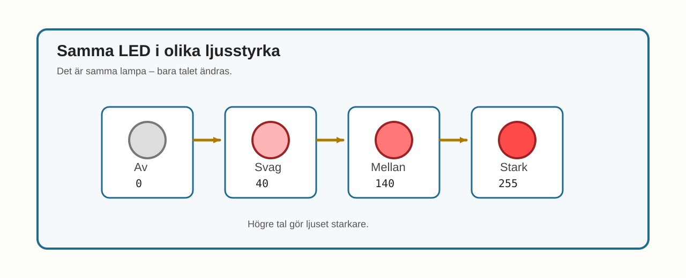
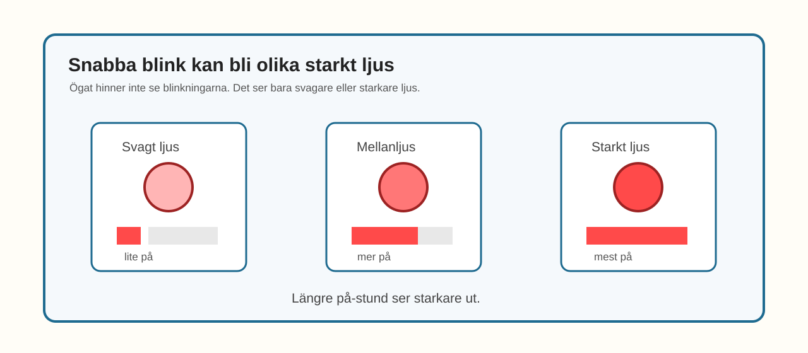

# E015 – Dimbar LED

## Uppdraget: gör en vanlig LED svagare och starkare

I E012 använde du RGB-värden mellan 0 och 255.

Då kunde en färg bli svagare eller starkare.

Nu gör vi samma idé enklare.

Vi tar bort färgerna så att bara ljusstyrkan blir kvar.

Vi går tillbaka till **en vanlig LED**.

En LED.

Ett motstånd.

En GPIO-pinne.

Då blir det lättare att se vad PWM gör med just ljusstyrkan.

> Samma LED kan lysa svagt, mellan och starkt.

---

## Dagens uppfinning

Du ska göra en dimbar LED.

Dimbar betyder att ljuset kan ändra styrka.

Du ska använda tal mellan:

> 0 och 255

Där betyder:

- `0` inget ljus,
- `40` svagt ljus,
- `140` mellanljus,
- `255` starkt ljus.

Det här är samma idé som i RGB-experimenten.

Men nu finns bara en ljuskanal.

Det gör experimentet renare:

> ett tal styr hur starkt en LED lyser.

---

## Du lär dig

När du gjort experimentet har du lärt dig att:

- återanvända en enkel LED-koppling,
- styra ljusstyrka med värden mellan 0 och 255,
- se skillnaden mellan av, svag, mellan och stark,
- förstå PWM som snabbt blink som ögat uppfattar som ljusstyrka,
- isolera PWM-idén utan RGB-färger,
- förbereda nästa experiment där ljuset tonar upp och ned.

---

## Du behöver


_Dagens delar: ESP32, breadboard, en LED, ett motstånd, kopplingskablar och USB._

| Del | Antal | Kommentar |
|---|---:|---|
| ESP32 DevKit | 1 | Samma som tidigare |
| Breadboard | 1 | Samma som tidigare |
| LED-lampa | 1 | Vilken färg du vill |
| Motstånd 220–330 Ω | 1 | Ett motstånd till LED-lampan |
| Kopplingskablar | 2–4 | Hane–hane |
| USB-kabel | 1 | För ström och uppladdning |

> **Vuxenkoll:** E015 går pedagogiskt tillbaka till en enkel LED för att isolera PWM-idén. Det är medvetet efter RGB-spåret, eftersom barnet nu redan har upplevt 0–255-värden i färgblandning.

---

## Innan du börjar

Du kan bygga en ny enkel LED-koppling.

Eller så kan du använda en LED-koppling från ett tidigare experiment om den sitter på GPIO 23.

I det här experimentet använder vi:

- LED på GPIO 23.

---

# Koppla så här

Koppla en LED-lampa med ett motstånd.


_Förenklad kopplingsöversikt: GPIO 23 går till LED-lampans långa ben. LED-lampans korta ben går via motstånd till GND._

Kopplingsvägen är:

> GPIO 23 → LED långt ben → LED kort ben → motstånd → GND

> **Byggtips:** Kom ihåg LED-riktningen. Det långa benet ska vara på GPIO-sidan och det korta benet ska fortsätta mot motståndet.

---

## Snabb kopplingskontroll

Följ vägen med fingret:

- GPIO 23 till LED-lampans långa ben,
- LED-lampans korta ben till motstånd,
- motstånd till GND.

> **Mikrokoll:** Om lampan inte lyser alls, kontrollera först LED-riktningen och att motståndet verkligen går vidare till GND.

---

# Koden

Nu använder vi ett enda värde för ljusstyrka.

Skriv in eller ersätt koden med denna:

```cpp
const int ledPin = 23;

void setup() {
  pinMode(ledPin, OUTPUT);
}

void loop() {
  analogWrite(ledPin, 0);
  delay(900);

  analogWrite(ledPin, 40);
  delay(900);

  analogWrite(ledPin, 140);
  delay(900);

  analogWrite(ledPin, 255);
  delay(900);
}
```

## Stanna och gissa

Titta på dessa två rader:

```cpp
analogWrite(ledPin, 40);
analogWrite(ledPin, 255);
```

Vilken rad tror du gör lampan starkast?

Vilken rad tror du gör lampan svagast?

Gissa först.

Ladda sedan upp koden.

> **Vuxenkoll:** Precis som i E012–E014 använder E015 `analogWrite()` som pedagogisk 0–255-ingång till PWM. Om vald ESP32/Arduino-version kräver LEDC/PWM bör den tekniska implementationen döljas bakom samma enkla idé: ett värde styr ljusstyrkan.

---

# Nu händer det

Lampan ska visa fyra tydliga nivåer:

> av → svag → mellan → stark



_E015 visar samma LED i fyra nivåer: av, svag, mellan och stark._

Titta noga.

Det är samma LED hela tiden.

Det enda som ändras är talet i koden.

---

# Vad händer egentligen?

E015 är som en förenklad version av E012.

I E012 blandade du flera färger.

Här finns bara en LED.

Då kan du titta på ljusstyrkan utan att färgerna stör.

När du använder `digitalWrite()` är lampan bara på eller av.

När du använder `analogWrite()` kan du ge den ett värde mellan 0 och 255.

ESP32 gör då ett mycket snabbt blinkmönster.

Ögat hinner inte se blinkningarna.

I stället ser det ut som olika ljusstyrka.



_PWM-idén på en vanlig LED: snabba blinkningar kan se ut som svagare eller starkare ljus._

Du behöver inte räkna på PWM.

Det räcker att komma ihåg:

> högre tal = starkare ljus.

---

# Testa

Ändra värdet `40` till `10`.

```cpp
analogWrite(ledPin, 10);
```

Kan du fortfarande se lampan?

Ändra sedan `140` till `220`.

```cpp
analogWrite(ledPin, 220);
```

Hur stor känns skillnaden?

---

# Utforska

Prova fler nivåer.

| Nivå | Värde |
|---|---:|
| Av | 0 |
| Mycket svag | 10 |
| Svag | 40 |
| Mellan | 140 |
| Stark | 220 |
| Full styrka | 255 |

Skriv in några av dem i `loop()`.

Vilka skillnader är lätta att se?

Vilka är svåra?

---

# Experimentera

Gör en egen ljusstyrketrappa.

Fyll i dina steg först:

| Steg | Värde |
|---|---:|
| 1 |  |
| 2 |  |
| 3 |  |
| 4 |  |
| 5 |  |

Testa sedan dina steg i koden.

Kan du få lampan att kännas som:

- en ficklampa,
- en sovlampa,
- en varningslampa,
- en liten scenlampa?

---

# Utmaning

Välj en nivå.

## Nivå 1 – Hitta minsta synliga ljuset

Prova små värden:

```cpp
analogWrite(ledPin, 1);
analogWrite(ledPin, 5);
analogWrite(ledPin, 10);
```

Vilket är det minsta värde där du ser ljus?

---

## Nivå 2 – Gör en trappa

Skriv flera nivåer efter varandra:

```cpp
analogWrite(ledPin, 0);
delay(500);

analogWrite(ledPin, 50);
delay(500);

analogWrite(ledPin, 100);
delay(500);

analogWrite(ledPin, 150);
delay(500);

analogWrite(ledPin, 200);
delay(500);

analogWrite(ledPin, 255);
delay(500);
```

Ser det ut som en trappa?

---

## Nivå 3 – Förbered andande ljus

Det här är en smygtitt på nästa experiment.

Prova att ändra värdet lite i taget:

```cpp
for (int value = 0; value <= 255; value = value + 5) {
  analogWrite(ledPin, value);
  delay(30);
}
```

Vad händer med lampan?

Du behöver inte förstå hela loopen ännu.

Titta bara på hur ljuset förändras.

---

# Vanliga ledtrådar

| Det du ser | Möjlig ledtråd | Testa |
|---|---|---|
| Lampan lyser inte alls | LED-riktning eller GND kan vara fel | Följ kopplingsvägen från GPIO 23 till GND |
| Alla nivåer ser nästan lika ut | Rummet kan vara för ljust eller skillnaden för liten | Testa 0, 40, 140 och 255 |
| Låga värden syns knappt | Det kan vara normalt | Prova i lite mörkare rum |
| Koden kompilerar inte | En parentes eller semikolon kan saknas | Jämför `analogWrite()`-raderna rad för rad |
| Ljuset flimrar synligt | PWM-inställning eller miljö kan påverka | Notera det för teknisk granskning |

> **Vuxenkoll:** E015 bör tekniskt granskas tillsammans med E012–E014 så PWM-implementationen blir konsekvent i hela kapitlet.

---

# För den vuxne

E015 isolerar PWM på en enda LED.

Det är medvetet en förenkling av E012.

Det gör experimentet extra viktigt även om kopplingen är enklare än RGB-experimenten.

Barnet ska uppleva att:

- ett tal kan styra ljusstyrka,
- ljusstyrka inte bara är på/av,
- PWM kan förstås genom observation,
- nästa experiment kan skapa en mjukare effekt med samma princip.

Bra frågor:

- Vilket värde gör lampan starkast?
- Vilket värde gör lampan svagast?
- Ser du skillnad mellan 40 och 140?
- Varför kan samma LED kännas som olika lampor?
- Vad tror du händer om värdet ändras lite i taget?

---

# Jag undrar...

Fundera på de här frågorna:

- Hur svagt kan ljuset bli innan du inte ser det?
- Ser alla människor små ljusstyrkeskillnader lika tydligt?
- Känns samma ljus olika i ett mörkt rum och ett ljust rum?
- Varför kan en lampa behöva vara dimbar?
- Var finns dimbara lampor i vardagen?

Du behöver inte svara på allt nu.

---

# Nästa experiment

Nu har du gjort en vanlig LED dimbar.

I nästa experiment använder vi samma idé.

Men i stället för att hoppa mellan nivåer låter vi ljuset ändras mjukt.

Då händer något nytt:

> Lampan kan börja se ut som om den andas.
