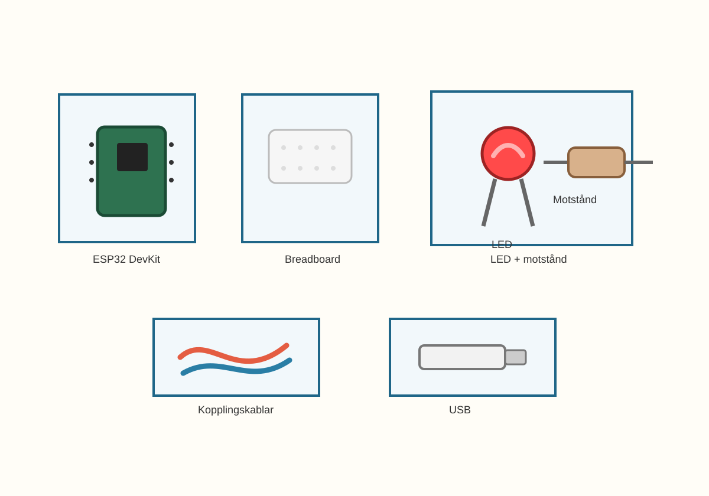
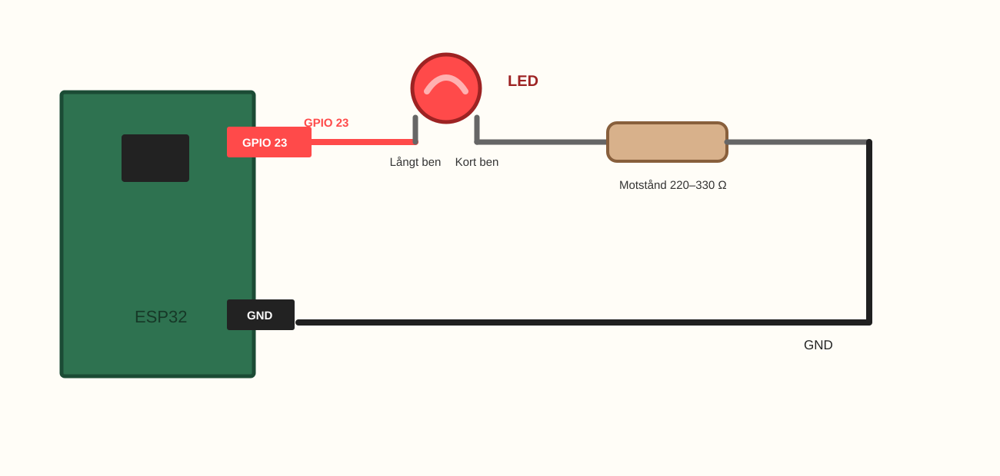
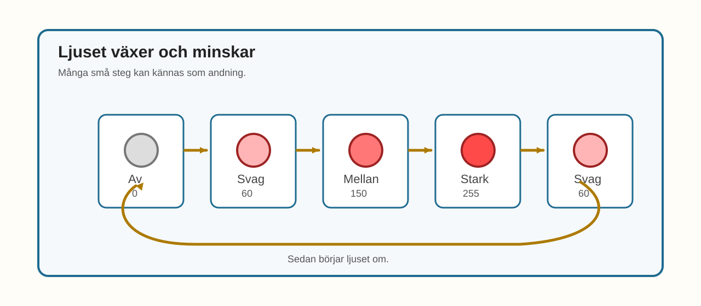
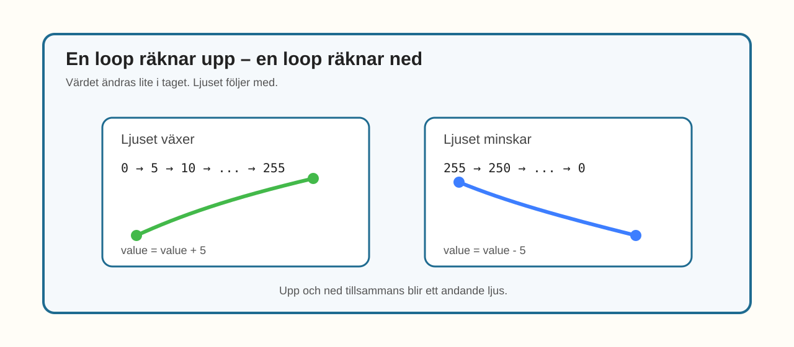

# E016 – Andande ljus

## Uppdraget: få en LED att andas

I E015 gjorde du en vanlig LED dimbar.

Du lät den hoppa mellan olika ljusstyrkor:

> av → svag → mellan → stark

Nu ska ljuset ändras på ett mjukare sätt.

Det ska långsamt bli starkare.

Sedan långsamt svagare.

Om det går lagom långsamt kan det nästan se ut som att lampan andas.

> När ljuset växer och minskar långsamt kan lampan kännas nästan levande.

---

## Dagens uppfinning

Du ska göra ett andande ljus.

Du använder samma enkla LED-koppling som i E015.

Det nya är koden.

I stället för att skriva varje ljusstyrka för hand låter du en loop räkna:

- upp från 0 till 255,
- ned från 255 till 0.

Det är som en ljusstyrketrappa med många små steg.

När stegen kommer tätt efter varandra känns ljuset mjukare.

---

## Du lär dig

När du gjort experimentet har du lärt dig att:

- återanvända LED-kopplingen från E015,
- använda en `for`-loop för att ändra ett värde lite i taget,
- låta PWM-värdet gå upp och ned,
- skapa en mjukare ljuseffekt,
- se hur `delay()` påverkar känslan,
- göra ett litet kapitelprojekt med bara en LED.

---

## Du behöver



_Dagens delar: samma delar som i E015 – ESP32, breadboard, en LED, ett motstånd, kopplingskablar och USB._

| Del | Antal | Kommentar |
|---|---:|---|
| ESP32 DevKit | 1 | Samma som tidigare |
| Breadboard | 1 | Samma som tidigare |
| LED-lampa | 1 | Gärna röd, gul eller blå |
| Motstånd 220–330 Ω | 1 | Ett motstånd till LED-lampan |
| Kopplingskablar | 2–4 | Hane–hane |
| USB-kabel | 1 | För ström och uppladdning |

> **Vuxenkoll:** E016 är kapitelprojektet för PWM-delen. Kopplingen är enkel så att fokus hamnar på den visuella effekten och på `for`-loopens upp/ned-rörelse.

---

## Innan du börjar

Om du har kvar kopplingen från E015 kan du använda den igen.

I det här experimentet använder vi:

- LED på GPIO 23.

---

# Koppla så här

Kopplingen är samma som i E015.



_Förenklad kopplingsöversikt: GPIO 23 går till LED-lampans långa ben. LED-lampans korta ben går via motstånd till GND._

Kopplingsvägen är:

> GPIO 23 → LED långt ben → LED kort ben → motstånd → GND

> **Byggtips:** Om E015 fungerade behöver du oftast inte bygga om. Kontrollera bara att LED-lampan sitter kvar åt rätt håll.

---

## Snabb kopplingskontroll

Följ vägen med fingret:

- GPIO 23 till LED-lampans långa ben,
- LED-lampans korta ben till motstånd,
- motstånd till GND.

> **Mikrokoll:** Om lampan inte lyser alls, testa först E015-koden eller kontrollera LED-riktningen.

---

# Koden

Nu använder vi två `for`-loopar.

Den första räknar upp.

Den andra räknar ned.

Skriv in eller ersätt koden med denna:

```cpp
const int ledPin = 23;

void setup() {
  pinMode(ledPin, OUTPUT);
}

void loop() {
  // Ljuset växer
  for (int value = 0; value <= 255; value = value + 5) {
    analogWrite(ledPin, value);
    delay(25);
  }

  // Ljuset minskar
  for (int value = 255; value >= 0; value = value - 5) {
    analogWrite(ledPin, value);
    delay(25);
  }
}
```

## Stanna och gissa

Titta på den här raden:

```cpp
value = value + 5
```

Vad tror du händer med ljuset?

Blir det starkare eller svagare?

Titta sedan på den här raden:

```cpp
value = value - 5
```

Vad tror du händer då?

Gissa först.

Ladda sedan upp koden.

> **Vuxenkoll:** E016 använder samma `analogWrite()`-modell som E015. Det tekniska beslutet om `analogWrite()` kontra LEDC/PWM behöver fortfarande granskas samlat för Kapitel 2.

---

# Nu händer det

Lampan ska långsamt bli starkare.

Sedan ska den långsamt bli svagare.

Och sedan börjar allt om.



_E016 visar ljuset när det växer och minskar steg för steg._

Titta på lampan en stund.

Känns den snabb?

Känns den lugn?

Känns det nästan som att lampan andas?

---

# Vad händer egentligen?

I E015 skrev du några ljusstyrkor för hand.

I E016 låter du koden räkna.

Först räknar den:

> 0, 5, 10, 15 ... upp till 255

Då blir ljuset starkare steg för steg.

Sedan räknar den:

> 255, 250, 245, 240 ... ned till 0

Då blir ljuset svagare steg för steg.



_Begreppsbild för E016: en loop räknar upp, en annan räknar ned._

Det är fortfarande samma LED.

Men nu förändras värdet lite i taget.

> Många små steg kan kännas som en mjuk rörelse.

---

# Testa

Ändra `delay(25)` till:

```cpp
delay(60);
```

Vad händer?

Känns ljuset långsammare?

Ändra sedan till:

```cpp
delay(10);
```

Vad händer då?

---

# Utforska

Ändra hur stora steg loopen tar.

I stället för:

```cpp
value = value + 5
```

prova:

```cpp
value = value + 15
```

Blir ljuset hackigare?

Prova också:

```cpp
value = value + 1
```

Blir ljuset mjukare?

---

# Experimentera

Gör ett andande ljus som passar en känsla.

| Känsla | Förslag |
|---|---|
| Lugn | långsam andning |
| Robot | snabbare andning |
| Nattlampa | svagt och långsamt |
| Varning | starkare och snabbare |

Testa att ändra:

- `delay()`,
- stegets storlek,
- högsta värdet.

---

# Utmaning

Välj en nivå.

## Nivå 1 – Långsam andning

Gör ljuset långsammare.

Prova till exempel:

```cpp
delay(50);
```

Vilket tempo känns mest lugnt?

---

## Nivå 2 – Inte hela vägen ned

Låt lampan aldrig slockna helt.

Ändra första loopen så den börjar på 30:

```cpp
for (int value = 30; value <= 255; value = value + 5) {
```

Ändra också den andra loopen så den stannar vid 30:

```cpp
for (int value = 255; value >= 30; value = value - 5) {
```

Hur känns ljuset nu?

---

## Nivå 3 – Eget andningsmönster

Gör ett eget mönster.

Till exempel:

- långsam upp,
- kort paus,
- snabb ned.

Du kan lägga till:

```cpp
delay(300);
```

mellan looparna.

---

# Vanliga ledtrådar

| Det du ser | Möjlig ledtråd | Testa |
|---|---|---|
| Ljuset ändras för snabbt | `delay()` är för lågt | Höj till `40`, `50` eller `60` |
| Ljuset känns hackigt | Stegen är för stora | Minska från `15` till `5` eller `1` |
| Lampan slocknar för länge | Loopen går hela vägen till 0 | Låt den stanna vid t.ex. `30` |
| Lampan lyser inte alls | LED-riktning eller GND kan vara fel | Följ kopplingsvägen från GPIO 23 till GND |
| Koden kompilerar inte | En klammer kan saknas i en loop | Kontrollera att varje `for`-loop har `{` och `}` |

> **Vuxenkoll:** Om `analogWrite()` byts mot LEDC/PWM i teknisk granskning bör barnets kodidé helst behållas: ett värde räknas upp och ned.

---

# För den vuxne

E016 är en sammanfattande effekt i Kapitel 2.

Barnet har nu mött:

- enkel LED,
- flera LED,
- RGB,
- färgblandning,
- färg som status,
- PWM som ljusstyrka,
- stegvis förändring.

E016 låter allt landa i en konkret visuell effekt som kan kännas som ett andande ljus.

Det viktiga är att barnet upplever sambandet:

> värdet ändras lite i taget → ljuset förändras lite i taget.

Bra frågor:

- Vad gör `value + 5`?
- Vad gör `value - 5`?
- Vad händer om stegen blir större?
- Vad händer om pausen blir längre?
- Varför känns ljuset mer levande när det förändras långsamt?

---

# Kapitelavslutning

Nu har du använt ljus på många olika sätt.

Du har fått LED-lampor att:

- blinka,
- turas om,
- röra sig i mönster,
- visa färger,
- blanda färger,
- visa status,
- lysa svagt och starkt,
- nästan andas.

Det började med enkla lampor.

Sedan blev ljuset mer och mer uttrycksfullt.

I nästa kapitel kan vi låta andra delar vara med och påverka vad som händer.

Då börjar prylarna kännas ännu mer interaktiva.
